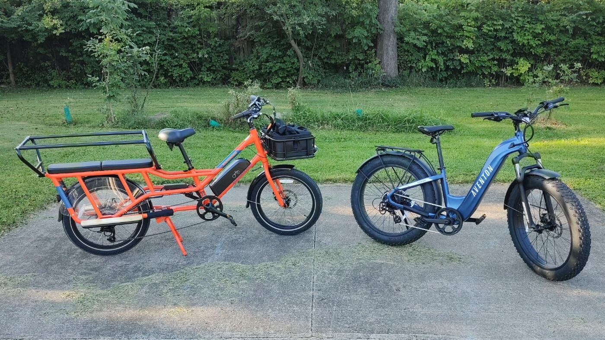

We got my wife the orange RadWagon 4 a bit over a month ago, and we both liked it so much that we decided to get a second #ebike, the blue Aventon Aventure.2.

We've replaced most in town car trips with these, and saved a tank of gas already!

The Aventure is more fun - it's faster, more aggressive, and handles bumps and off-road riding much better.

The RadWagon is far more practical, with more storage, less road noise, and seating for two kids on the back!

### 2026 Update

Several years and thousands of miles in, I'm still very happy with both of these bikes! 

When we first got the Radwagon, my kids loved to ride in the back to go to the pool and other places. Now that they're a bit older, they both tend to prefer to ride in their own bikes, but it still gets plenty of use for light grocery runs and the like. I have a cooler as well as a [trunk organizer](/reviews/2026-07-04-collapsible-trunk-organizer) that each fit nicely in the back seat.

I did get one flat tire on the Radwagon, it turned out one of the spokes was poking it on the inside. The [local bike shop](https://www.troyfamilybike.com/) didn't carry the right size innertube, so I ordered a couple from Rad Powered Bikes, and then they installed it for me. (I don't mind working on bikes, but I'm terrible at getting disc brakes aligned correctly, so I'm happy to give the local shop my business.)