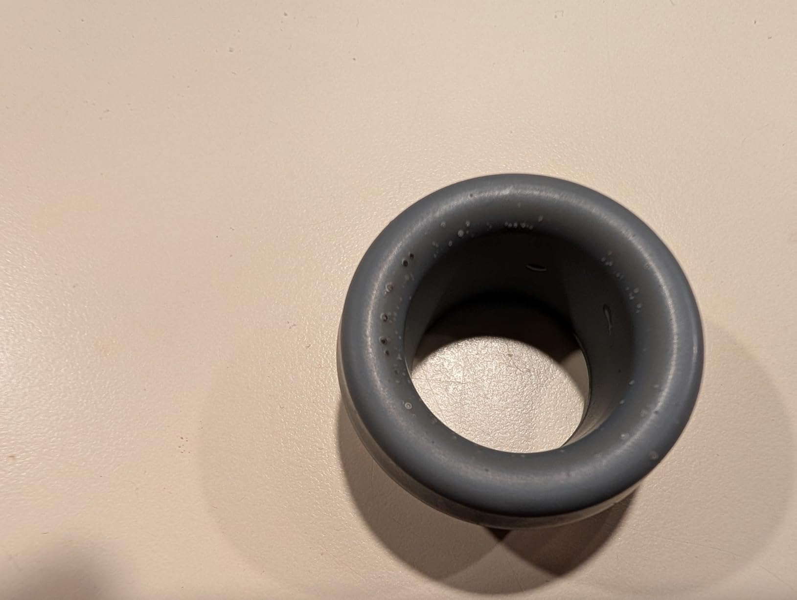
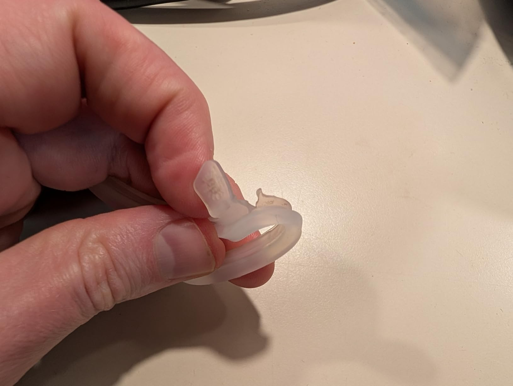
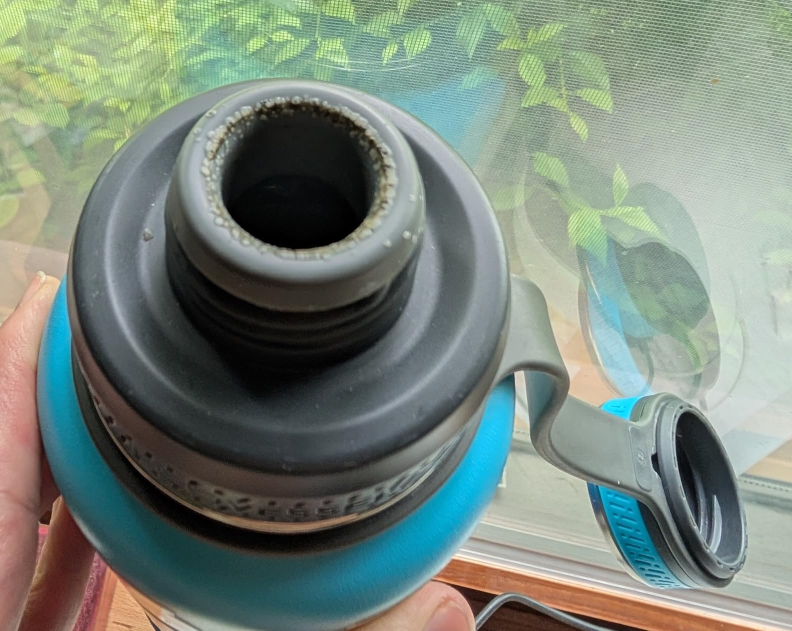

My wife and I bought two of these last year and hers is still in good shape, but mine started showing little "blisters" in the rubber around the opening after a few months. Also the ring between the lid and the bottle started to tear. I contacted the company and they said they were out of stock of both parts and didn't have a restock date. They said I could purchase a new lid, which would include the damaged parts, but the link they sent me showed they were sold out of those too.

Over the next 2-3 months the blisters got worse and some of them "popped" and became much harder to clean. I contacted the company again and they said they still didn't have the replacements in stock but I could sign up for SMS notifications to be notified when they did. So far all I've received is generic spam from them, nothing specific to the part I need.

