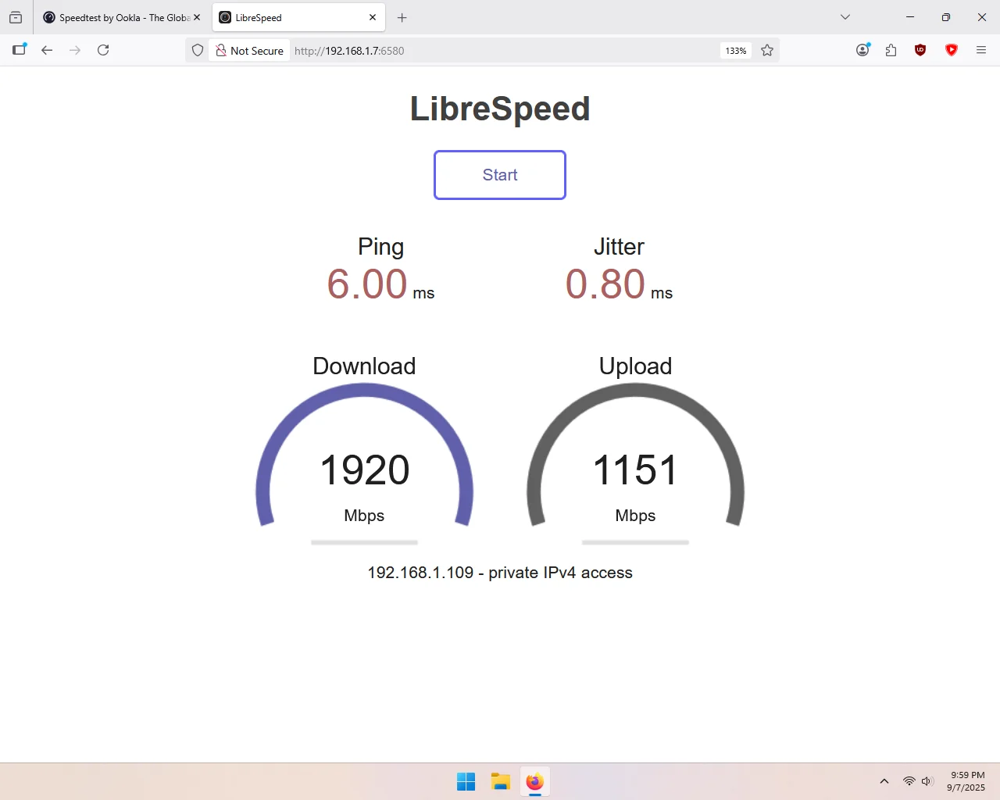
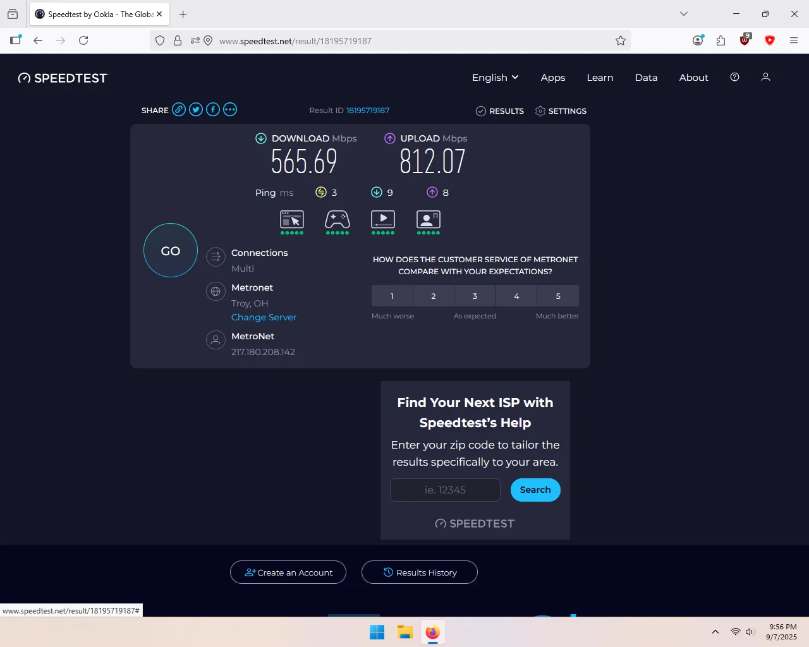

Works great! Real-world download speeds of nearly 2Gbps on my LAN, and 565Mbps on the internet! I also, appreciate that it includes the low-profile adapter (which is fairly easy to install), the internal USB cable (for BT?), and even some extra screws. Bluetooth appeared to work, although I didn't actually test it. Aside from the nonsense "5374Mbps" advertising, I'm very happy with it.

