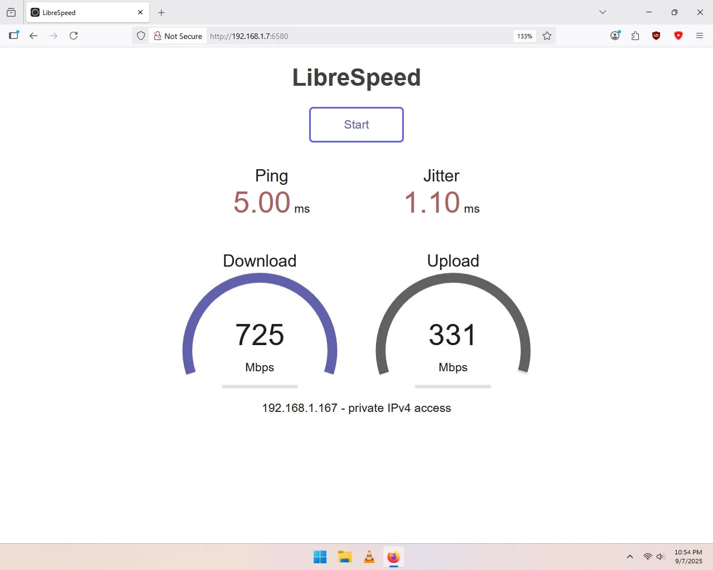

Works good, real-world download speeds of ~725mbps! Windows 11 has a built-in driver. The way the antennas are connected to the bracket makes it a bit more work to swap between half-height and full-height, but it is do-able, and the half-height bracket is included. Bluetooth appeared to work, although I didn't actually test it.

