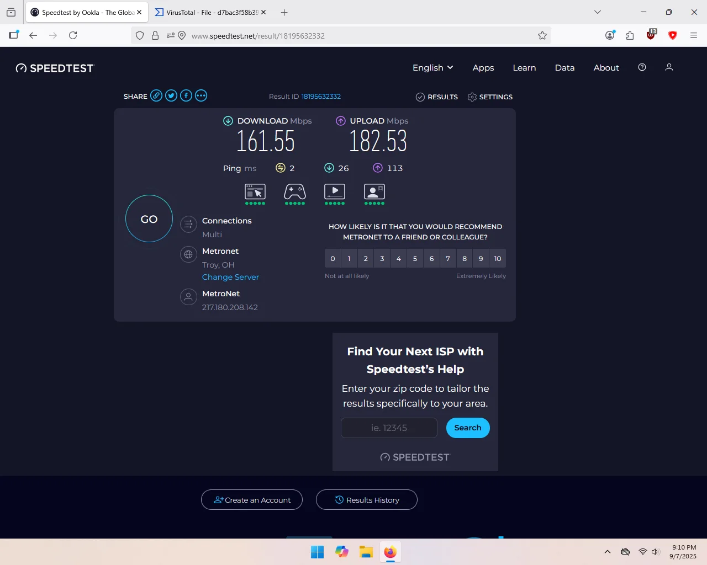
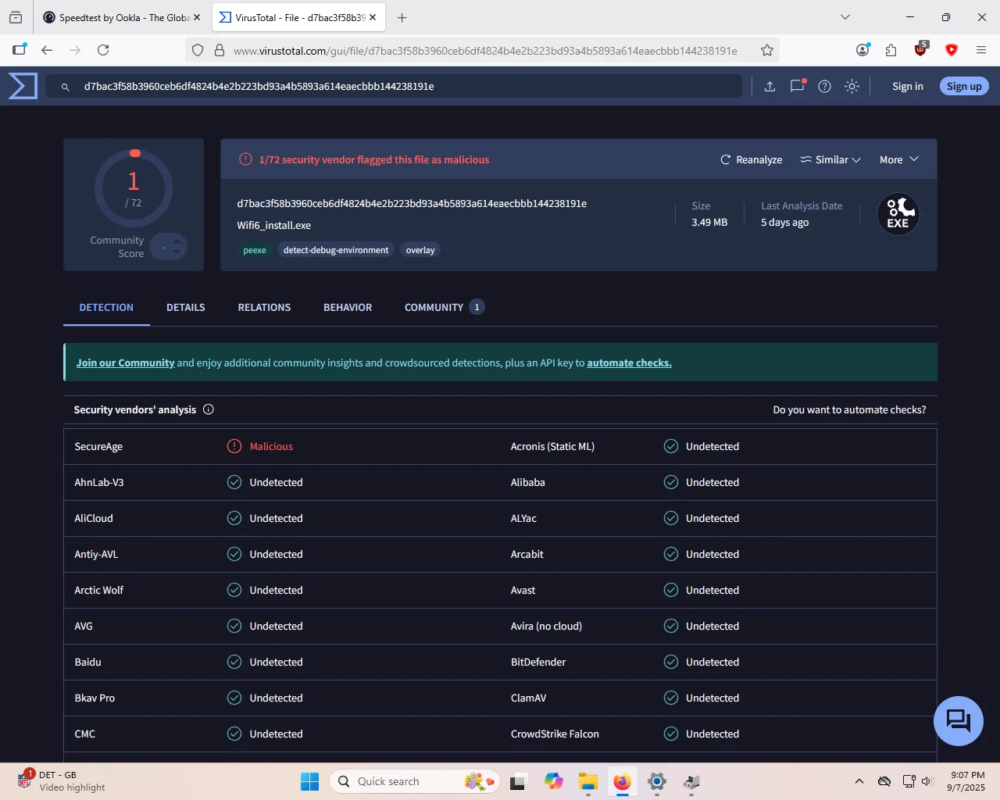

Works fine, real-world wifi speeds are around 160-180Mbps (5Ghz, Wifi 6, 1 gigabit internet connection). Bluetooth appears to work, although I didn't connect it to anything, I just scanned for nearby devices and it saw a few. The driver is not built-into windows, instead the device appears as a USB flash drive with a Wifi6_install.exe that you have to run to install the driver. After you install it, the flash drive disappears, although if you uninstall the driver, it's hard to get the flash drive to re-appear. I uploaded it to virustotal and 71/72 scanners passed it, 1 claimed it was malicious.

