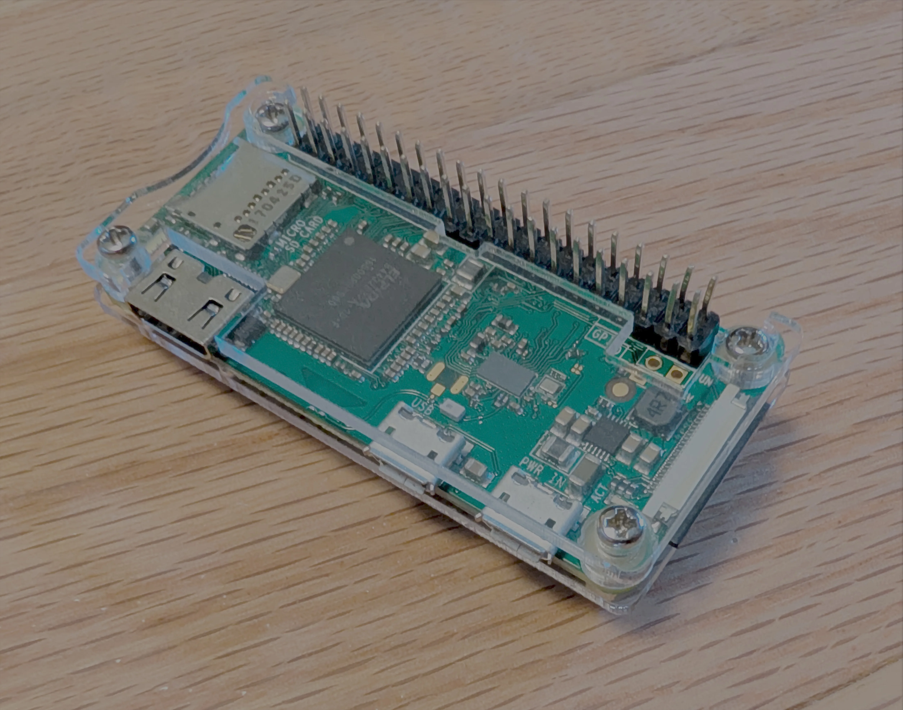
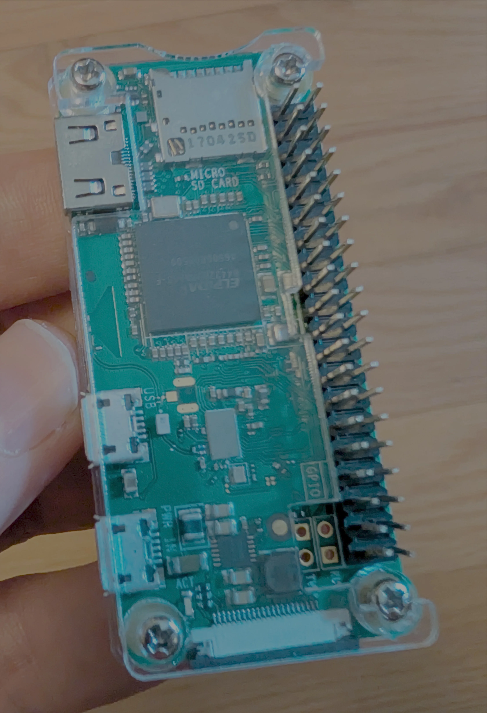
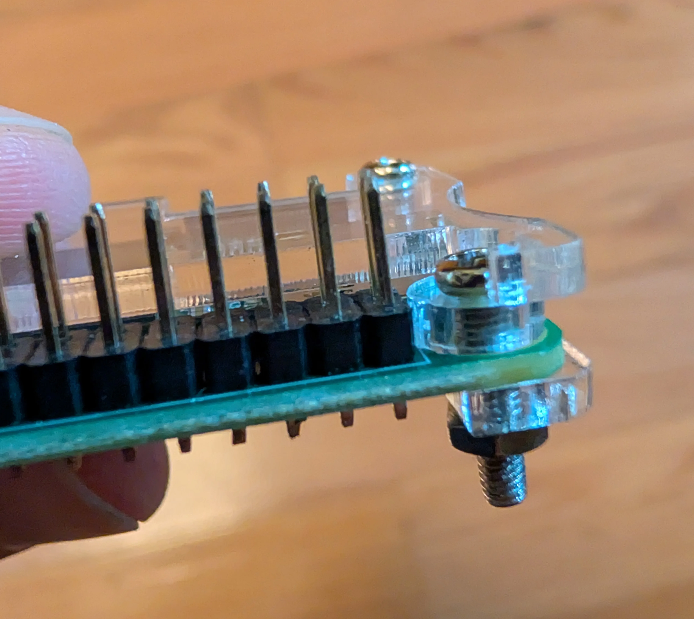
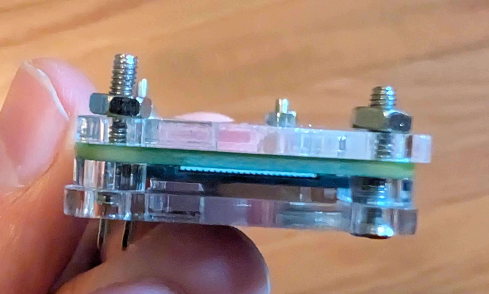
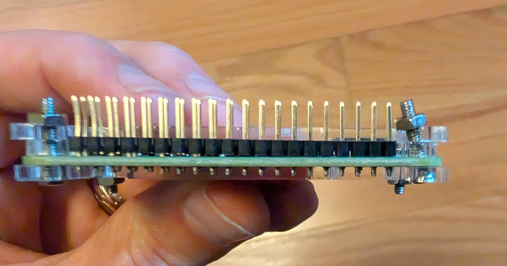

Acrylic case works and looks nice, as long as you don't mind the "feet" being slightly different heights, causing it to sit at an angle. Assembly was a little bit confusing and I'm not sure I got it right yet, because on mine the screws on either side of the gpio header go past the top layer instead of holding it down, and then they stick out of the bottom farther than the screws beside the USB and HDMI ports. It also seemed like the other screw holes were a little bit too big, but they were also slightly offset from the raspberry Pi's screw holes, and so between the two they do not slide through. (If I flip the screws around to come from the bottom side, then the ones by the GPO IO end up at an angle and nearly touch the pins.) I think they should have either used screws with larger heads, or put smaller holes in the acrylic so that the screw heads couldn't slip through, otherwise it seems fine.

