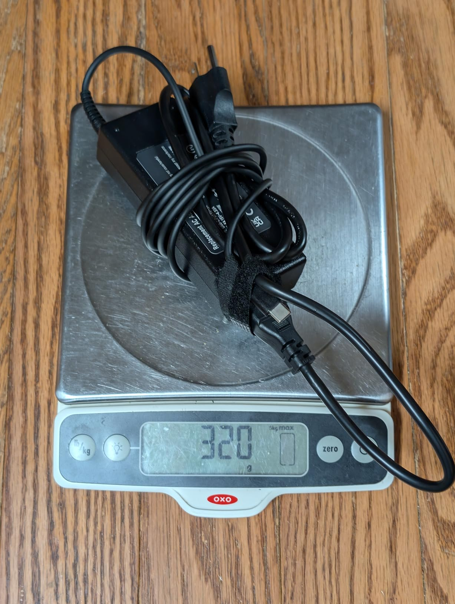
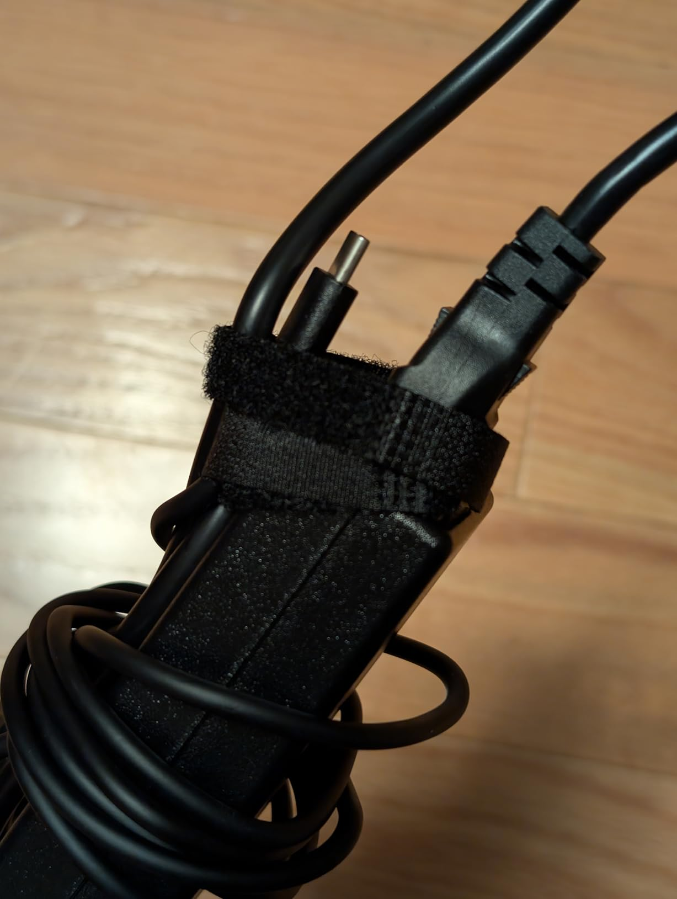
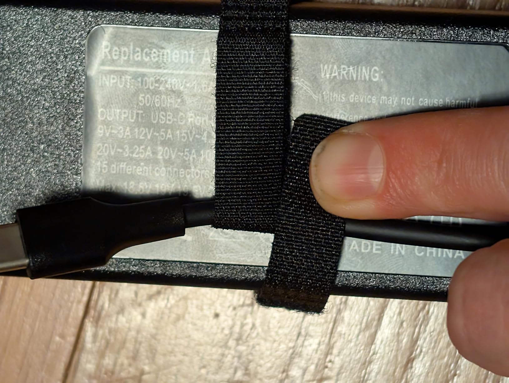

Overall I'm pretty happy with this charger. It's not the smallest 100W charger I own, but it's fairly compact and lightweight, and it does it's job well. It's suitable for leaving plugged in at your desk, or keeping in a bag for traveling.

It supports a wide variety of devices, basically anything compatible with the USB Type-C Power Delivery (USB-C PD) standard. That includes most laptops these days, but also most other USB-C devices.

It a supports a variety of voltages:

* 5V for basic things like my earbuds

* 9V for my phone

* 15V for my iPad

* 20V for my laptop

(It also reportedly supports 12V, which was used in earlier versions of the USB PD spec, but I don't think I currently have any devices that require that voltage level, so I couldn't test it.)

The only things it's probably not compatible with are the *really* cheap devices that are designed to only be charged from USB-A ports, and omit the circuitry to negotiate USB-C charging (literally just two resistors, ~$0.01 worth of parts).

On the other end of the spectrum, if you have a higher-powered gaming laptop, this charger might be able to keep up with it while gaming, but it can recharge it in-between sessions.

I don't know if I own anything that can draw the full 100W, but I did get 87~88W out of it when charging my Macbook Pro while running Cinebench r23 - which is the exact same amount that I get out of the official 140W Apple charger if I use a USB-C cable. (You have to use a Magsafe cable to get the full 140W.)

Above 5v there's a small voltage drop, so the actual delivered power level is slightly below the target voltage, but it's always well within the specifications and less than some other chargers I've tested. Still, given that it has a permanently attached USB-C cable, it would have been nice if they had measured the voltage drop it creates and compensated for it in the power brick.

There are no lights on the brick, which isn't my preference but I know some do prefer it, and it's probably a little more efficient this way.

The total length is about 8'4", a bit shorter than the advertised 9.07 feet. (The A/C side lost a few inches.)

The weight, including cables, is 320g, also a bit less then the advertised 380g. (Perhaps it had a longer cable when they measured it?)

The USB-C cord is permanently attached and not replaceable, which is a bit of a bummer. It does feel like the connection to the power brick is fairly sturdy, with a decent bit of strain relief on the power brick side, but not as much on the laptop end of the cable. The cable itself feels sturdy enough.

It has a velcro strap for holding the cable together, although it's too short to wrap around the brick, so I wrapped it around the cable instead.

The AC cable is about 3' long and uses the standard IEC 60320 C5 connector

(sometimes called a "Micky mouse cable"). It is replaceable, which is convenient if you need a longer or shorter one, or you're going to a country that uses a different electrical outlet. (The charger supports 100-240V input, although I only tested ~110V.) It's a very snug fit; it took me a couple of tries to get the plug all the way into the brick.

All in all, it's a decent charger for $16.

