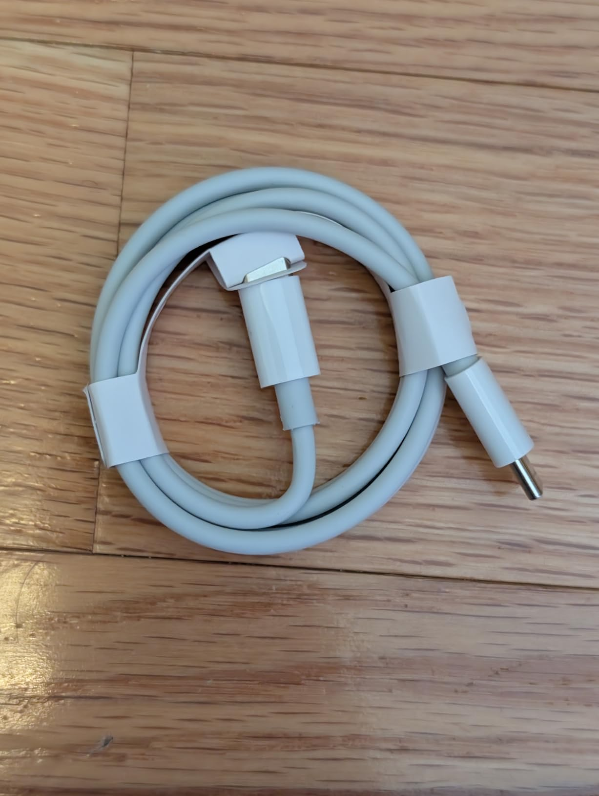
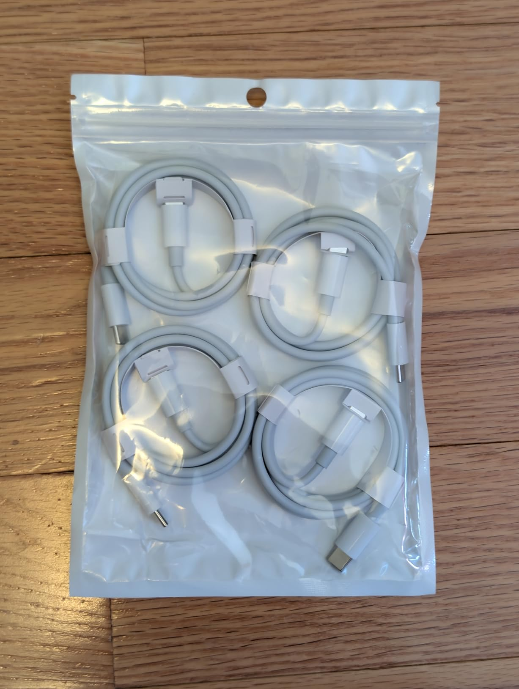
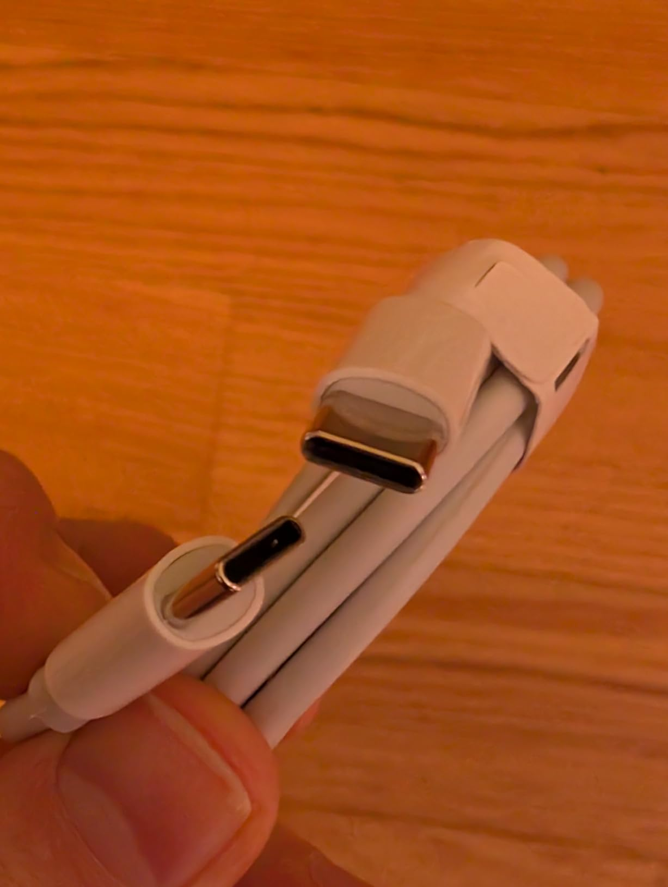
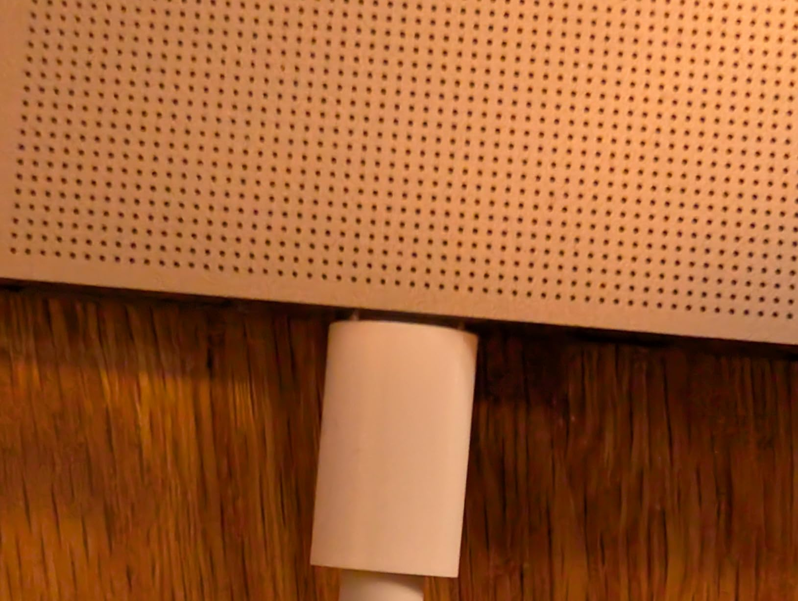
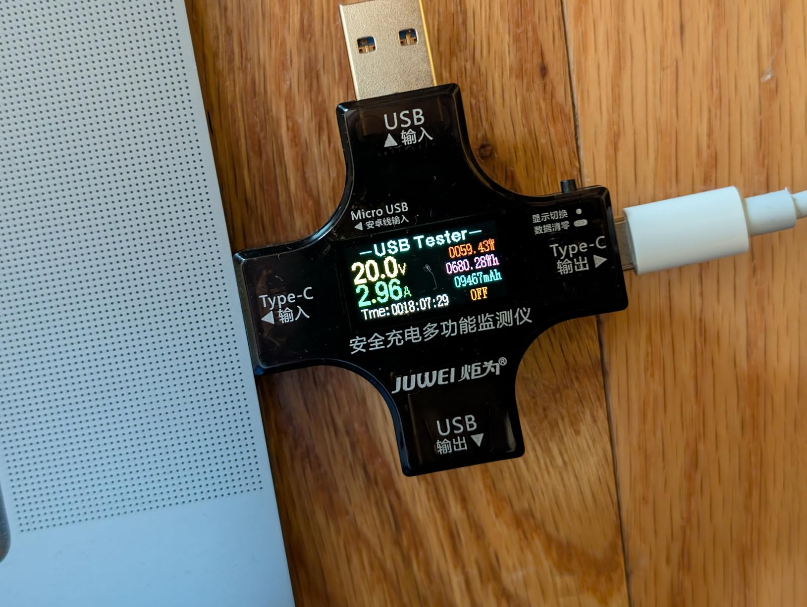
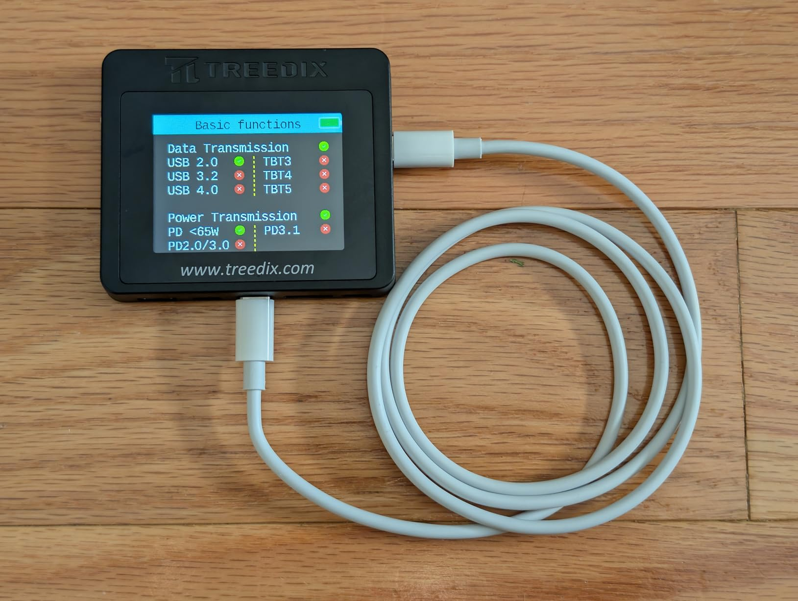
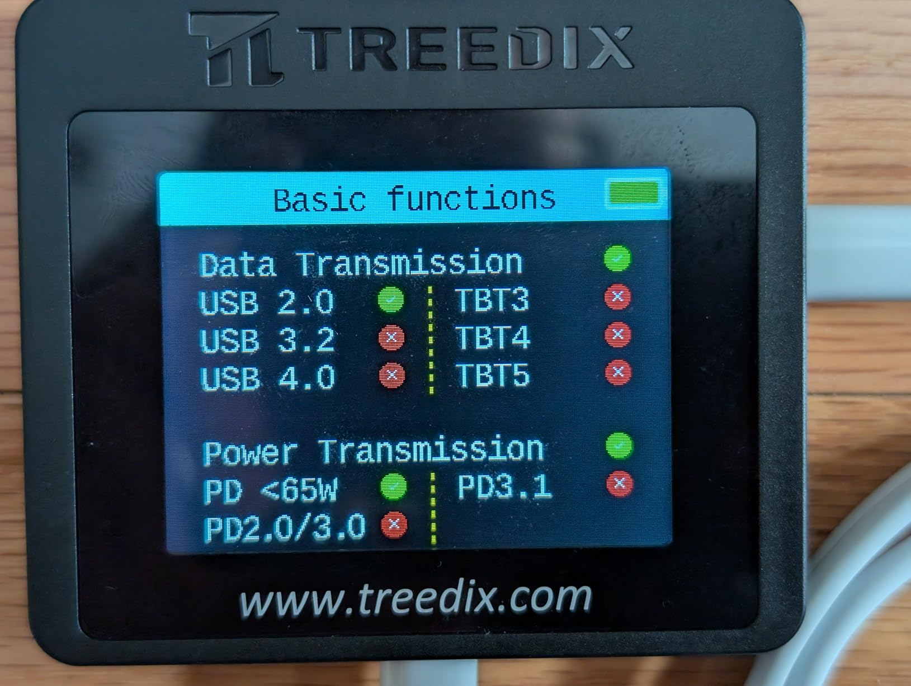
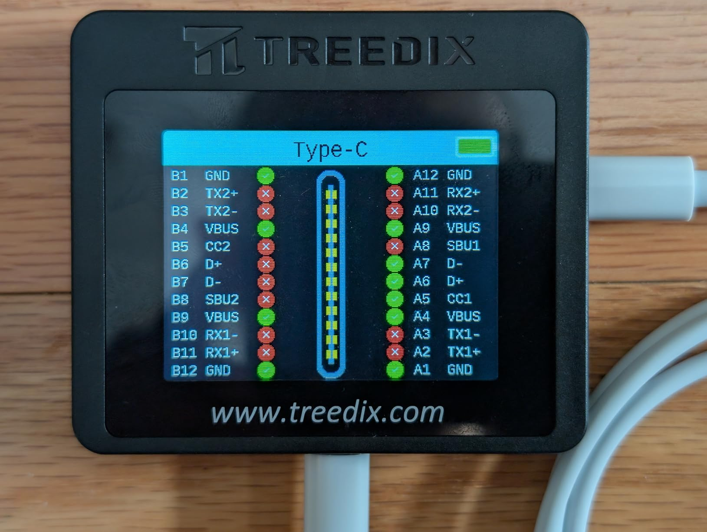
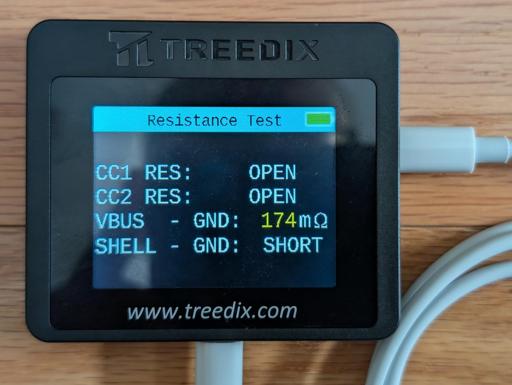
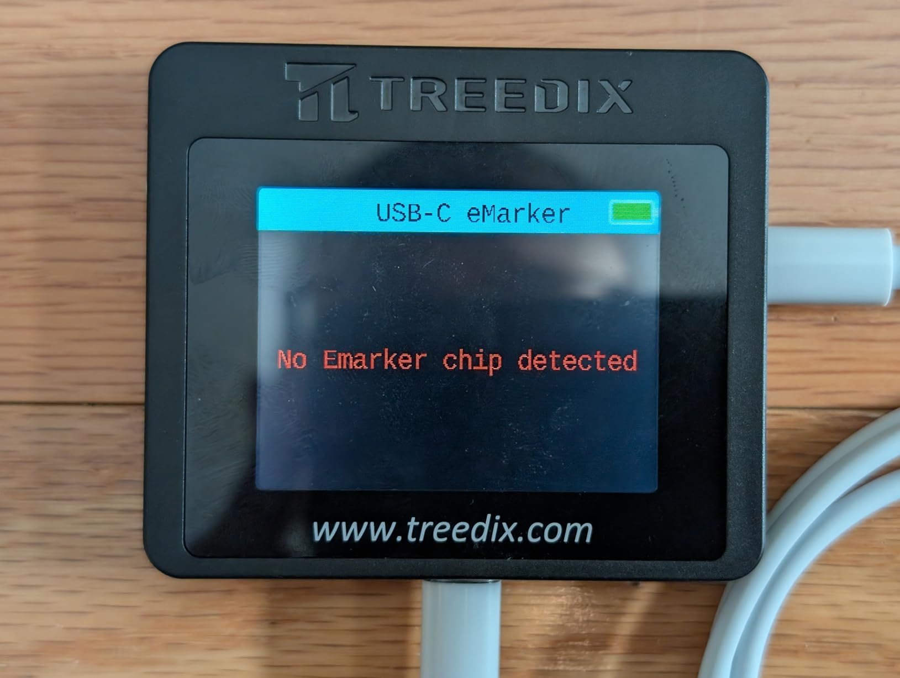

This is a great cable for charging most USB-C devices: any smartphone or tablet, camera, earbuds, even low-to-medium powered laptops at up to 65W (3.25A * 20V).

The only thing that might need more power is higher-end laptops that need 100w or more. And even then, they can usually slow-charge with this cable, but the battery might still drain if you're using the laptop while charging it with one of these cables.

It can also be used for a data cable in a pinch - it only supports USB 2.0 speeds (30-40 megabytes per second in real-world use) - but that's enough to transfer a few photos or other small files.

The cables are about 3'1" long + a bit for the connectors themselves. They are fairly sleek, with thin housing at about 9.9x6.8mm (small enough to fit within most phone cases) and modest strain relief - very reminiscent of Apple charging cables.

The internal resistance of 174mΩ in the cable I measured is pretty good - that equates to less than 3% power loss at it's maximum charging speed.

Overall these seem like decent cables and a 4-pack means you're more likely to have one when you need it!

