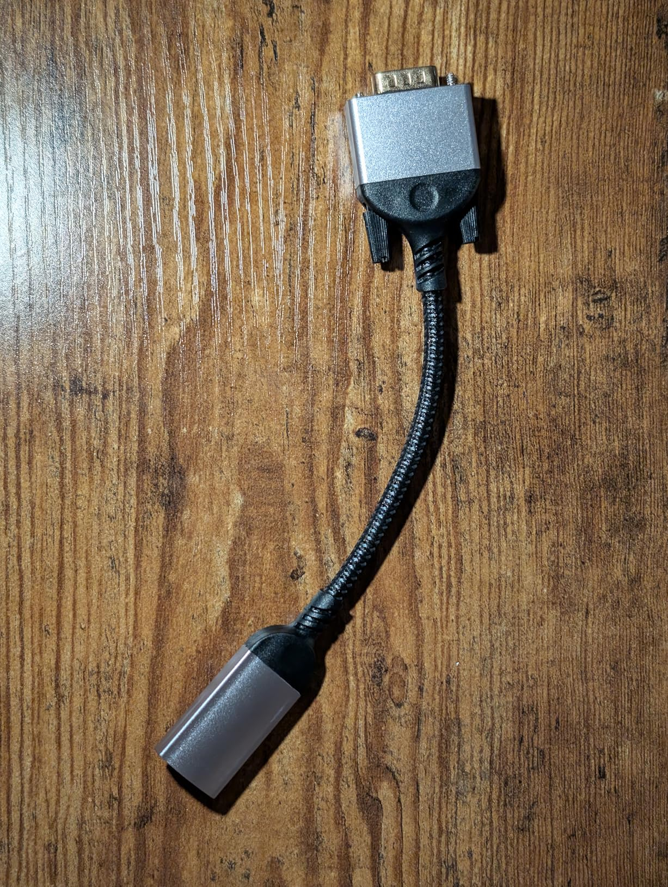
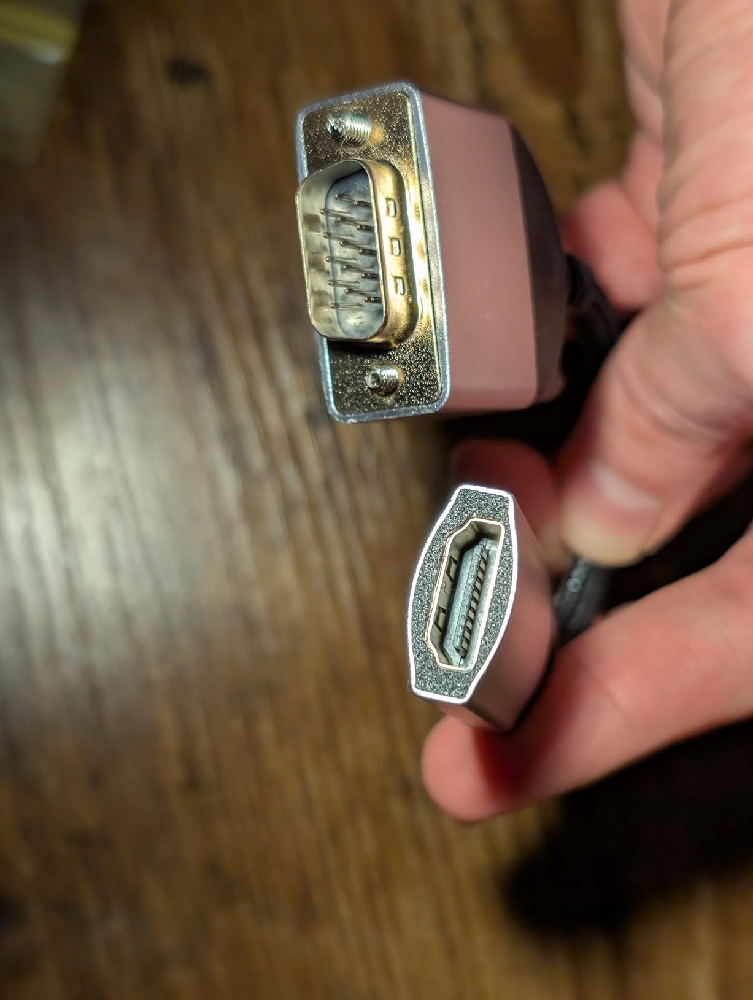
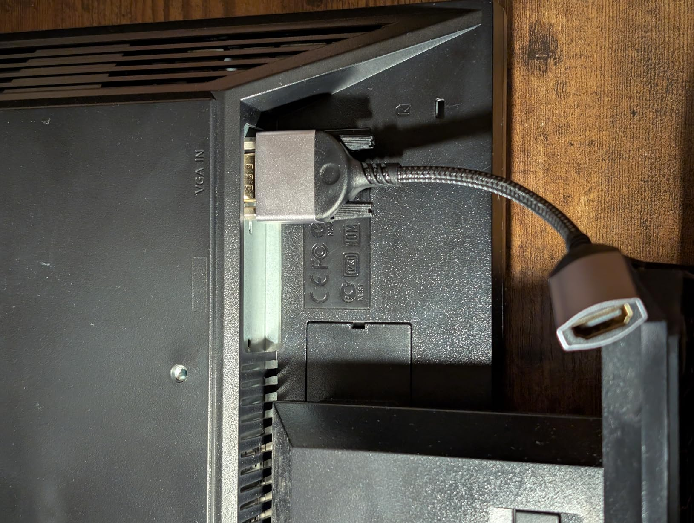

This is perfect for connecting an older monitor or projector to a newer computer with an HDMI output.

I tested it on one monitor with a resolution of 1280x1024 and another that was 1440x900, and it worked great at 60 HZ on each.

I also tested it with my USB-C only laptop, connecting first to a hub with an HDMI output, and then connecting that via a HDMI cable to this adapter, and then to the monitor. It was kind of a silly chain of adapters and dongles, but it worked!

The adapter feels durable, and I also find it easier to plug into the dongle that's hanging an inch or two down from the monitor rather than trying to plug the cable directly into the monitor, so it's a win for ergonomics also!

