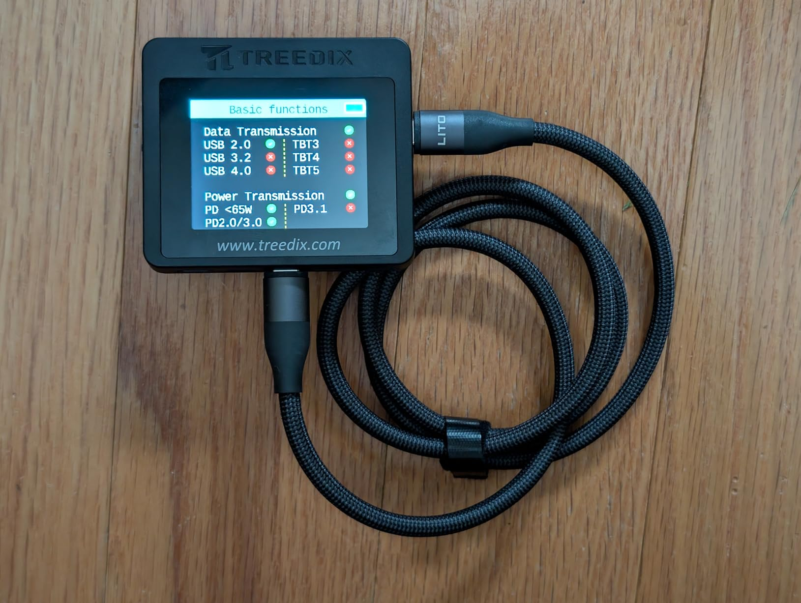
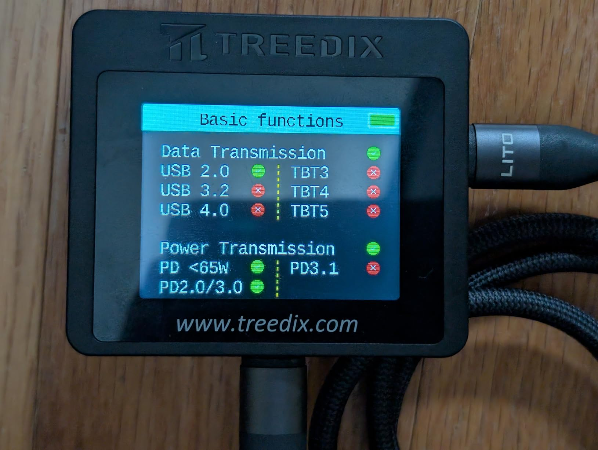
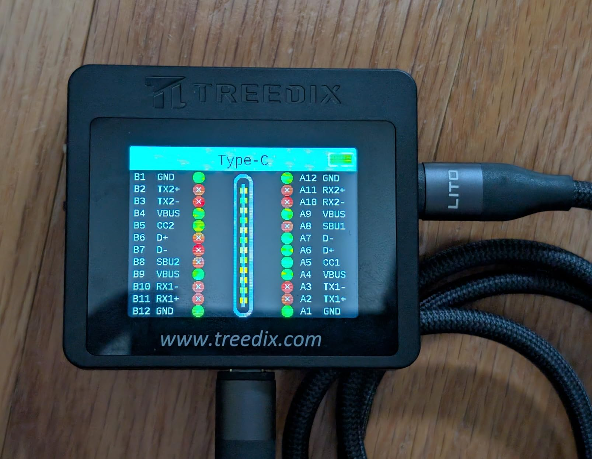
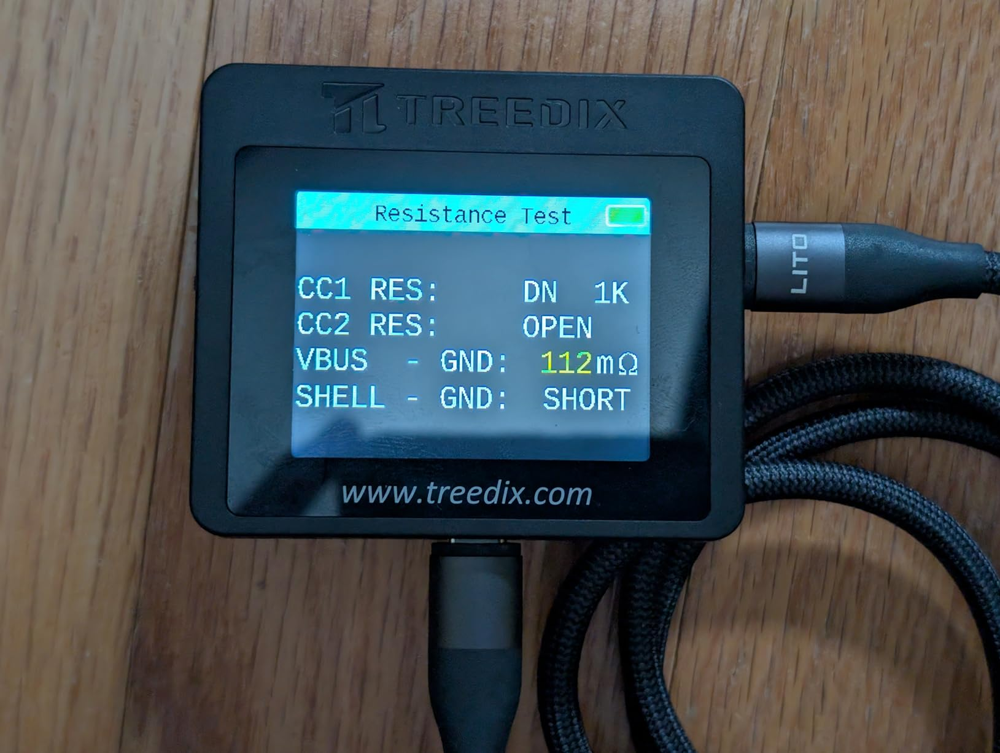
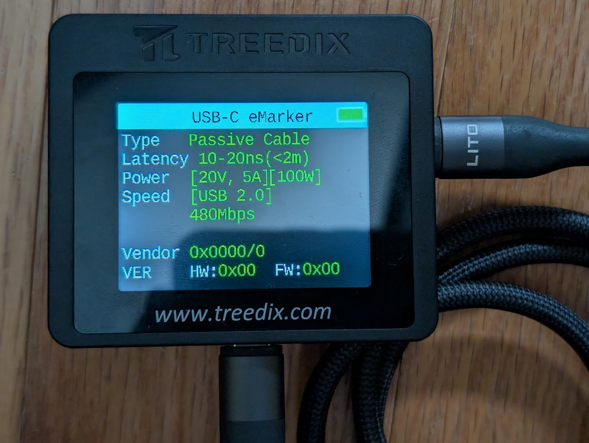
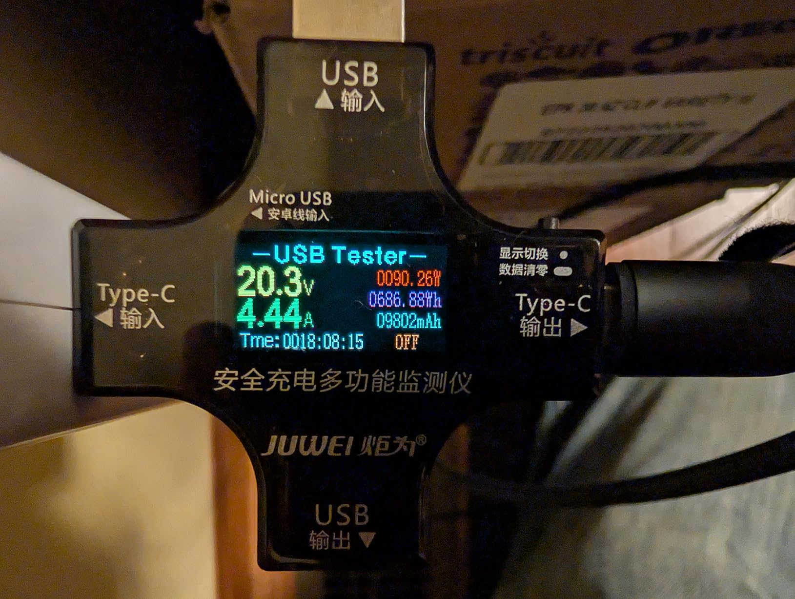
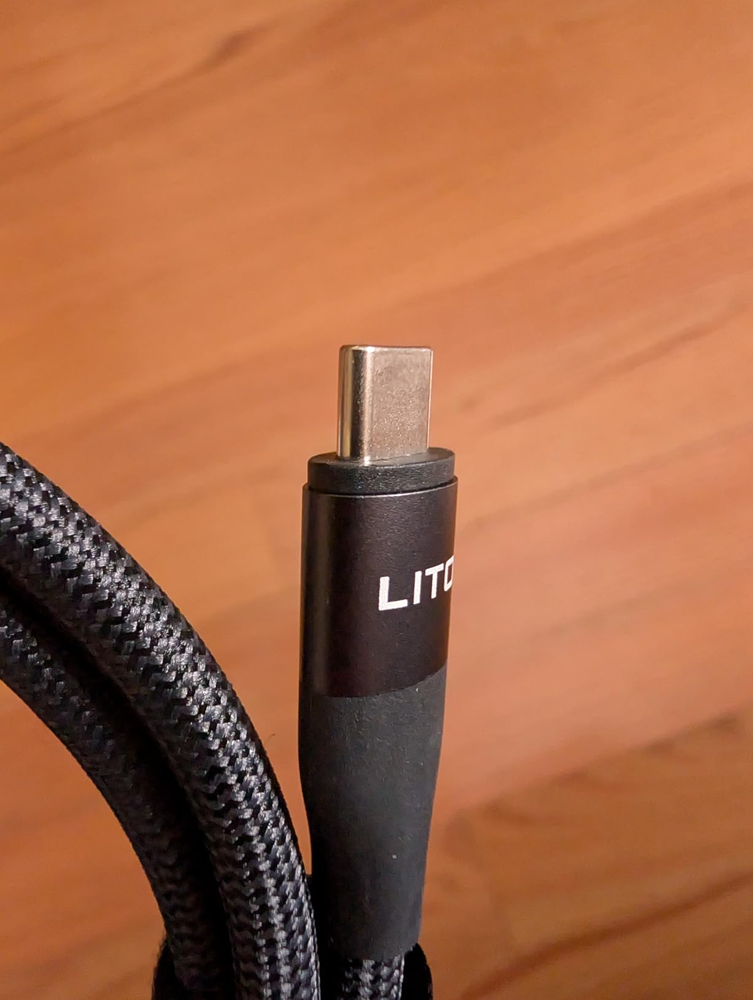
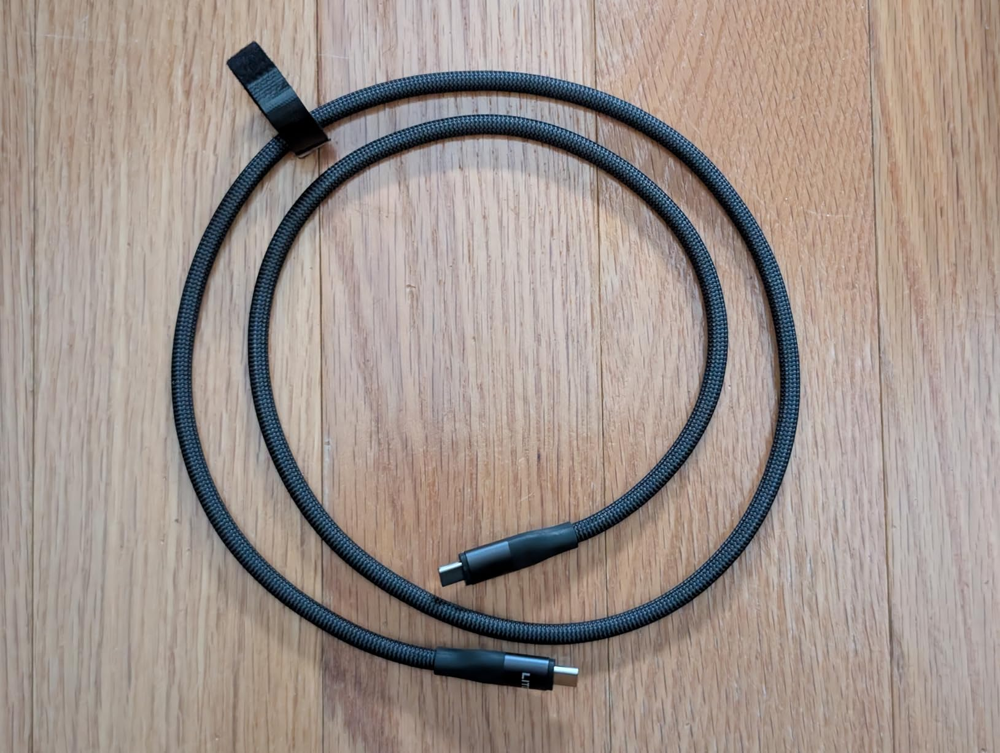

This is a great for charging most laptops, and just about any other usb-c device: phones, tablets, earbuds, etc. - provided the device is within 3 ft of the charger!

It can also be used for a data cable in a pinch - it only supports USB 2.0 speeds (30-40 megabytes per second in real-world use) - but that's enough to transfer a few photos or other small files.

The cable itself is very thick, at about 5.6mm, but it's more flexible than you might expect. It has a pleasant feeling braided wrapper.

The housing is a little chunky, but small enough to fit in my phone's case. The first 1.6mm nearest the USB-C plug is 12.2 x 6.9mm, then the rest of the housing is 12.8 x 7.5mm. The cable is just over 3 ft long, plus a little more for the connectors.

There's only a moderate amount of strain relief, but with the thickness of the cable I don't anticipate it being a major problem.

I measured the resistance at 112mΩ, which is pretty good, it equates to power loss of less than 3% at 100w. (And even less at lower wattages!)

The cable has an embedded e-marker, chip, which is required for charging at greater than 65w. It was indeed able to deliver 90 watts to my MacBook Pro (which is about the maximum that it's willing to draw over usb-c, even with the official 140w charger and an Apple cable - it only goes over 100w with magsafe.)

Overall, I'm very happy with this cable.

