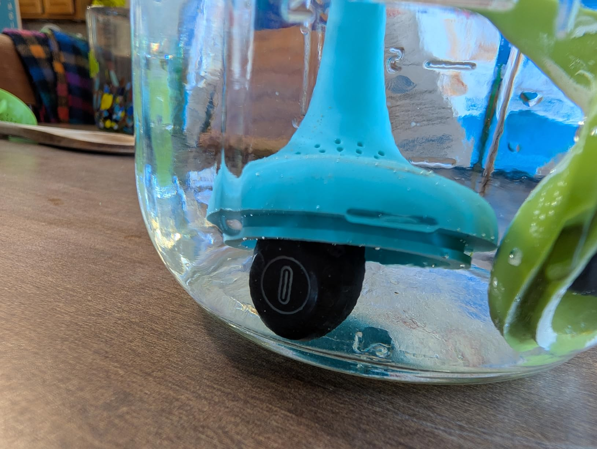
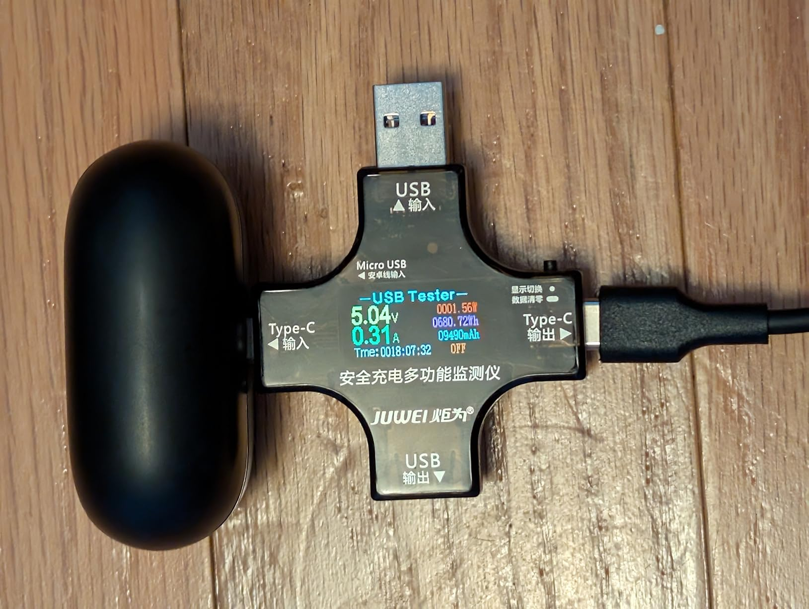

These are kind of amazing for $7, so while I have a few complaints, I really can't knock them very hard.

Quick summary:

+ Good sound quality (once you get a good fit to your ear)

+ Strong connection

+ Hot-swappable

+ Controls make sense and work well

+ Long battery life (although perhaps not quite the 80 hours they advertise)

+ Latency compensation in apps that support it

+ Waterproof

- Poor microphone quality

- High latency (1/3~1/2 seconds) for anything that doesn't support latency compensation

- Only supports older codes (AAC, SBC)

- Incompatible with some older high-power USB-c chargers

- Inaccurate battery meter

- Bluetooth versions shenanigans

Sound and fit

When I first got these earbuds, I was happy with the overall package, but underwhelmed by the sound quality. Mids and trebs were fine, but the bass felt really lacking. Then I happened to notice that if I pushed them into my ear, they suddenly sounded better, more balanced. And then if I pushed a little harder, the bass became overpowering and everything started sounding muddy. But as soon as I let go, they went back to "meh" sound quality. They came out-of-the box with the medium sized eartips, but I tried switching to the larger ones and noticed an immediate difference - much better sound, without me having to hold them in my ears just right. So, I believe the initial problem was not the drivers, but the seal with my ear. It also cuts out more outside noise with the larger eartips.

However, I did find the medium eartips a little more comfortable, and I generally prefer a more open experience rather than sealing off the outside, so I'm probably going to switch back to the medium tips soon. I mostly listen to audiobooks (1-2 per week) and some podcasts and youtube, with music being a distant 4th place, so the sound quality isn't the highest importance for me. (I also have some nice big over-ear headphones that I generally reach for when I do want to listen to some music.)

Battery life

I'm a pretty heavy earbuds user, and I initially thought the battery life was incredible - the case stayed above 90% for the first 3 days, and I only ran the buds down to their low battery beep a couple of times during the first month or so I've had these. However, the meter on the case isn't as accurate as you might hope - the lower it goes, the faster it drops. Over the next 3 days it dropped to around 50%, and then on the 7th day it dropped down to 14%! I think the earbuds themselves have a somewhat similar curve, although I haven't paid as close attention. Even as heavy of a user as I am, I'd wager it was more like 30-40 hours of battery life on a charge - not the 80 hours they claim - and a lot of that with only 1 earbud in use. Still, a solid week's worth of battery life isn't bad.

Controls

The responsiveness of the controls is pretty good - it generally does what I want on the first try, and when I'm trying to adjust the earbuds without touching the controls, that usually works too.

There are a couple of mistakes in the image that lays out the controls, here's what I've figured out from testing them:

* 1 tap (left or right): play/pause

* 2 taps: previous track (left), next track (right)

* 3 taps: volume down (left), volume up (right)

* 4 taps: alternate between "music mode" and "game mode" (lower latency)

* long press: launch voice assistant on phone

Also, there's an Easter egg of sorts in one of the other photos it shows an AMD Ryzen CPU :)

Single-earbud use

I do most of my listening with only a single earbud in, and this pair is fantastic for that. I can switch from one Year to the other without any interruptions to the audio.

Latency / video

The latency on these is pretty bad, especially in the default music mode (~480ms), but even in game mode it's pretty bad (~300ms). Trying to watch YouTube with these is kind of annoying because nothing is lip synced.

However, apps that support latency compensation such as Plex are synchronized perfectly because the earbuds report their delay to the phone and then the phone plays the audio ahead of time.

Microphone / phone calls

The microphone quality is kind of meh even when it works, and one time when I went to test them out the right earbud was just recording garbled tones, nothing that sounded like my voice at all. The next time I went to test it, it worked fine. This was not too long after I dunked it and water, so maybe it just hadn't fully dried out.

Waterproof

IPX7 is an Ingress Protection rating that indicates a device can be submerged in water up to 1 meter for 30 minutes without suffering damage.

I don't have anything that's a meter deep, but I did submerge them in about 7 inches of water, and they were still playing music when I pulled them back out half an hour later. The controls and sound quality were both degraded until it dried back out, but everything seems to work fine now.

Status messages/tones

This is a fairly minor thing, but is has voice status messages for certain things ("powered on", "connected", "game mode"), but some if them seem mispronounced, e.g. "connneched". Also, other things such as low battery just get tones instead of a voice message.

Bluetooth version shenanigans

As far as I can tell, Bluetooth 5.5 is not a real thing. Everything I've found indicates that the spec went from 5.4 to 6.0. In addition, when I connect it to my phone they claim to be version 0 according to the ADB logs, which is also not a real thing.

Latency compensation was introduced in version 5.0, so they're at least that new. However, version 5.3 introduced the LC3 codec which these earbuds do not support (they only do AAC and SBC - no aptX or or LDAC either). So my guess is that they are actually somewhere in the range of 5.0 to 5.2, but I could be wrong.

Charging

These earbuds charge at 5 volts and are compatible with most chargers. The only ones where they have trouble are very old usb-c laptop chargers that don't support analog voltage negotiation (Early versions of the spec allowed this, more recent versions require the high-powered charger support both options.)

I don't know how long they take to charge because I just leave them plugged in overnight about once a week 🤷‍♂️

Range and connection strength

The connection on these earbuds is excellent. At one point I left phone inside and went outside, and got probably 60-70 feet away before connection started dropping. I had to return to 30~40 feet before it got reliable again. Inside my house it can maintain a clear connection through multiple rooms and walls.

I didn't test the range with the "game mode" enabled, although my guess is that it would be more vulnerable to dropouts and hiccups in exchange for it's lower latency. It seemed fine when I was holding the phone right in front of me, though.

Conclusion

Overall I'm really happy with these earbuds, I now carry them with me everyday.

