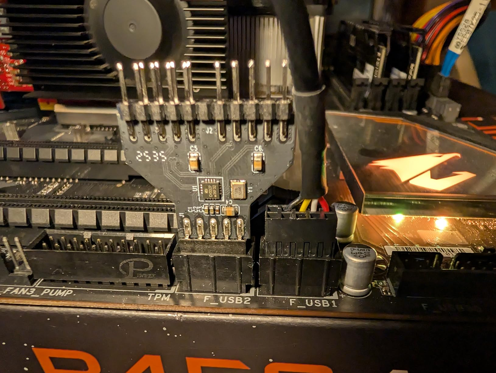
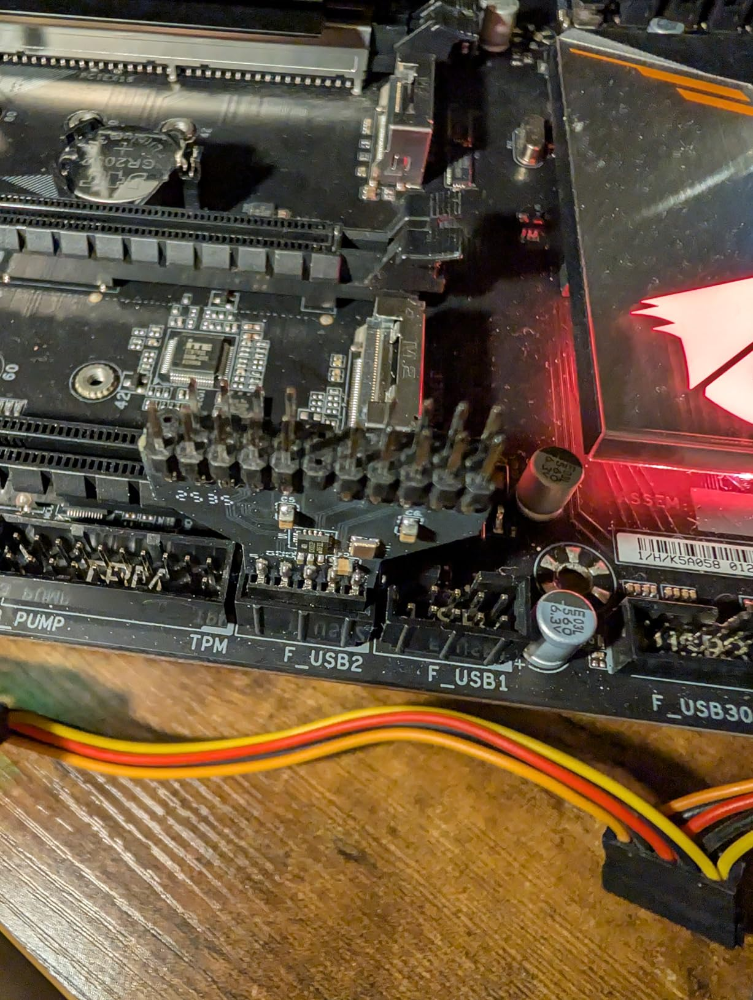
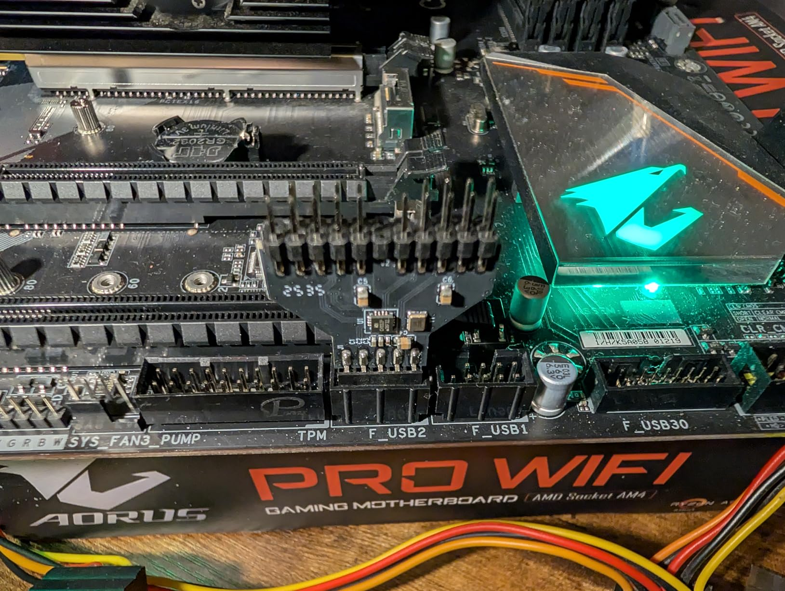
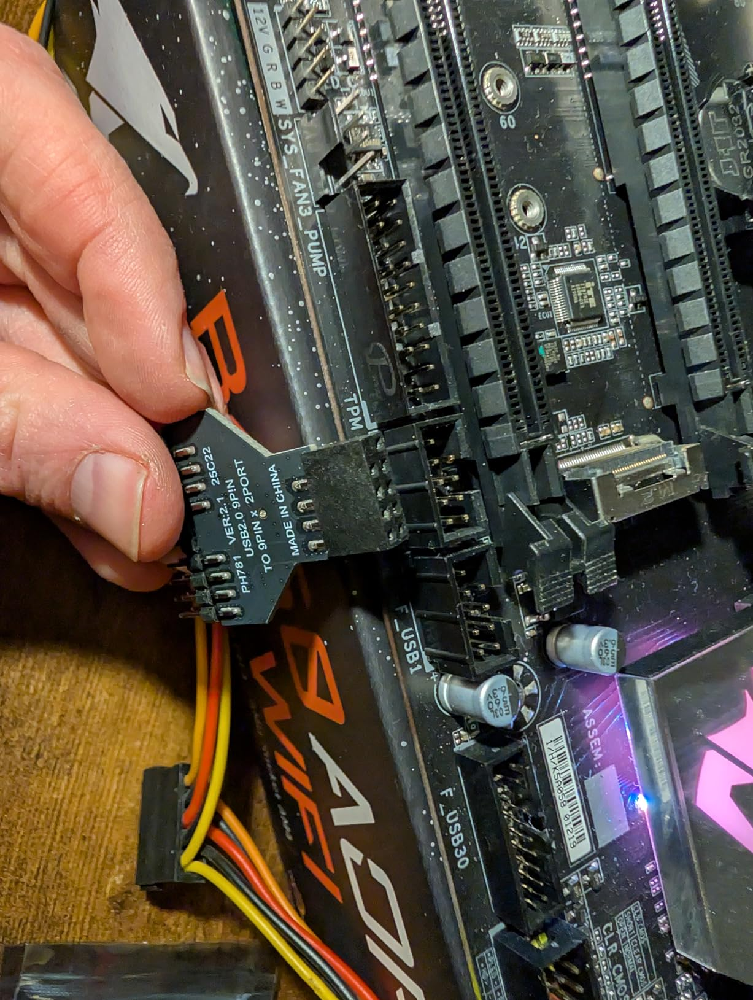

Works, but the implementation is sub-par from a bandwidth perspective. Each 9-pin header on the motherboard is actually two USB ports, so this splitter, going from one 9-pin to two 9-pin headers is really going from 2 USB ports to 4 USB ports. You might naively expect that to mean that each port gets half the bandwidth, but in fact one of the ports on the motherboard isn't even used, and the other one is split 4 ways. Splitting 2 and 2 would require a second USB hub chip, but splitting 1:3 and then passing the other port through directly would just need 4 extra traces on the motherboard.

That said, this is USB 2.0, and if you actually needed high bandwidth you'd use a USB 3.0 or newer port. So, it probably doesn't matter in practice.

The other thing to be aware of is that the Y-shape of this splitter means that it's partially covering the ports on either side of it. This didn't turn out to be a problem in my case, but it could be in yours.

Summary from USB Device Tree Viewer:

Vendor ID : 0x1A86 (Nanjing Qinheng Microelectronics Co., Ltd.)

Product ID : 0x8095

Manufacturer String : ---

Product String : "USB Hub"

Serial : ---

USB Version : 2.0 (480 Mbit/s)

Port maximum Speed : High-Speed

Device maximum Speed : High-Speed

Device Connection Speed : High-Speed

Self powered : yes

Demanded Current : 100 mA

