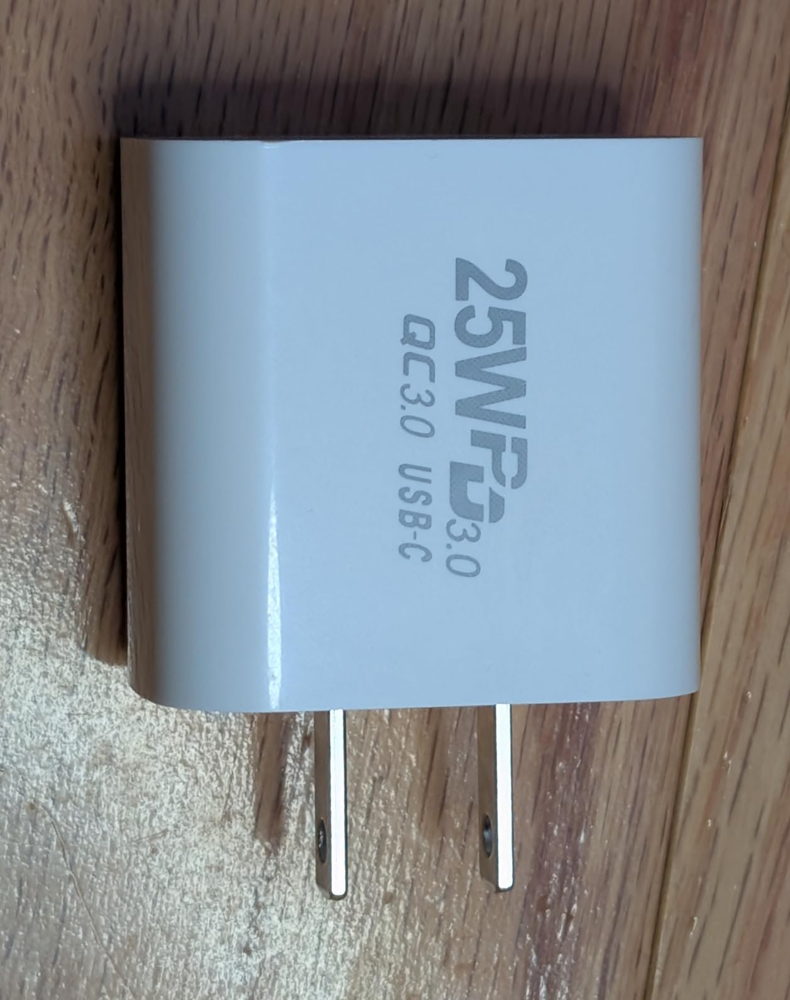
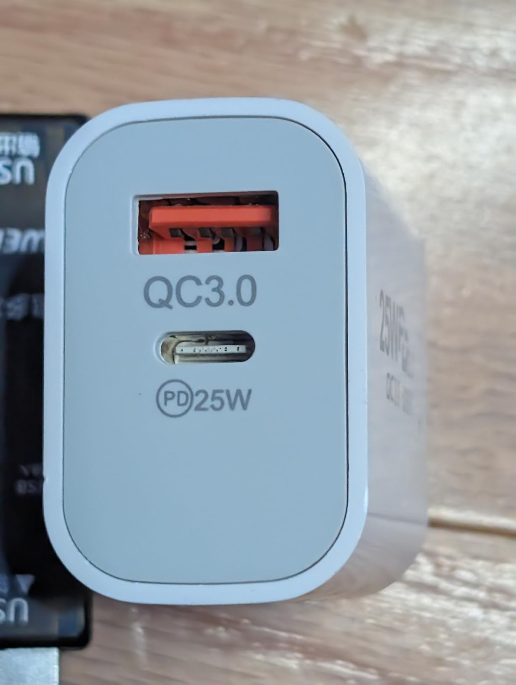
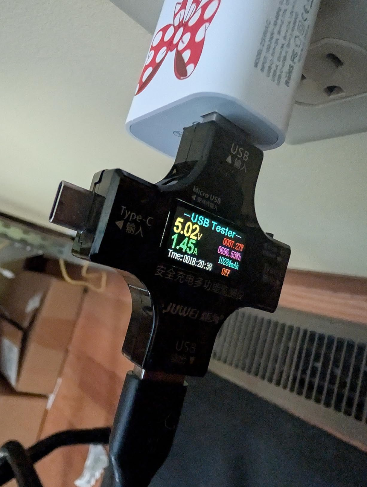

This is a cute little charger that's great for low-powered devices like smartphones, tablets, earbuds, etc. It can even (slowly) charge my macbook at about 19w! (Although I also tried with a Windows laptop and that one refused to charge.)

According to the power specifications on the side, it can only hit the advertised 25W in one specific scenario: a single device connected to USB-C and charging at 9v. Fortunately, many phones can charge at 9v, so it is a realistic scenario. When testing with my phone, I saw it reach a peak of about 23.5W.

In all other cases the power output is lower, typically in the 15-20w range.

It's also worth pointing out that it can only charge at 5v when both ports are in use, with a max combined power output is 17w.

Additionally, when going from 1 port in use to 2 ports, it briefly cuts power to both - even if it was already at 5v. So, probably not a great choice for powering something like Raspberry Pi that doesn't take kindly to it's power being interrupted.

The artwork seems cute, it reminds me of Minnie Mouse - I think my daughter will like it.

