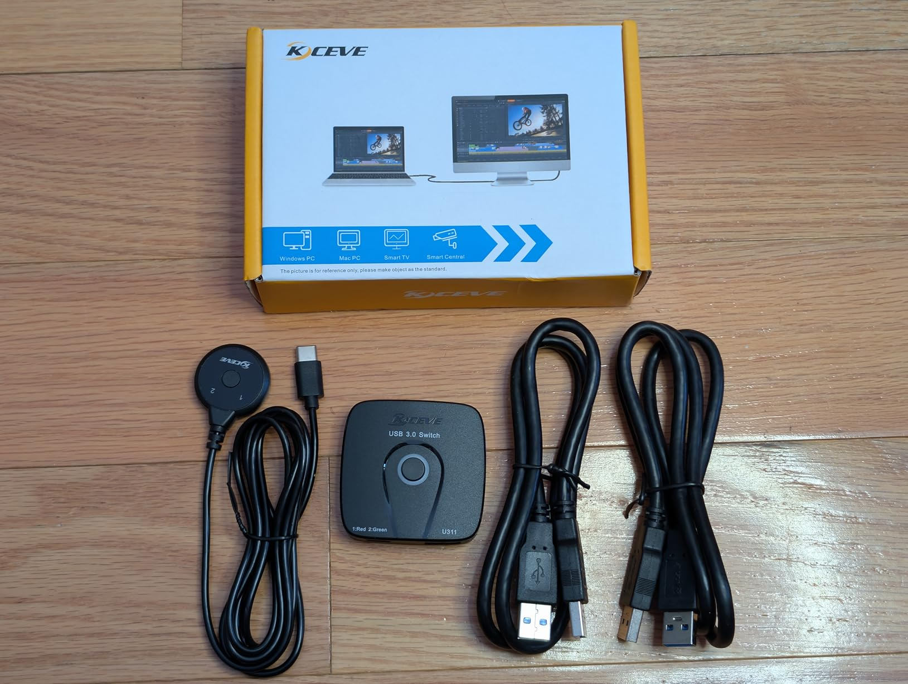
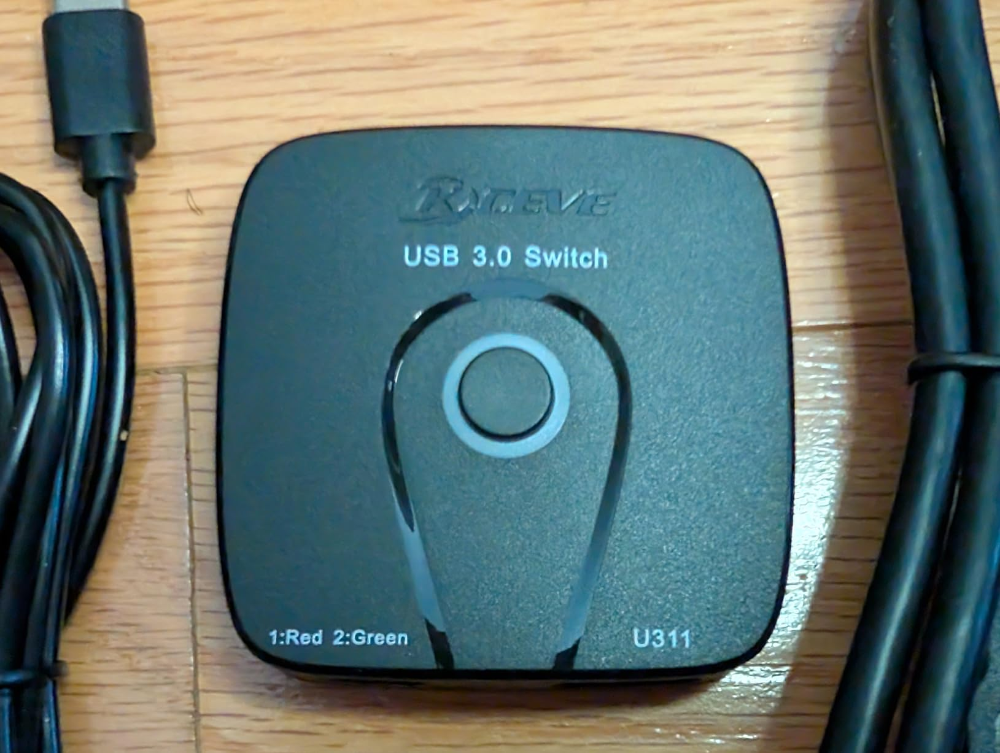
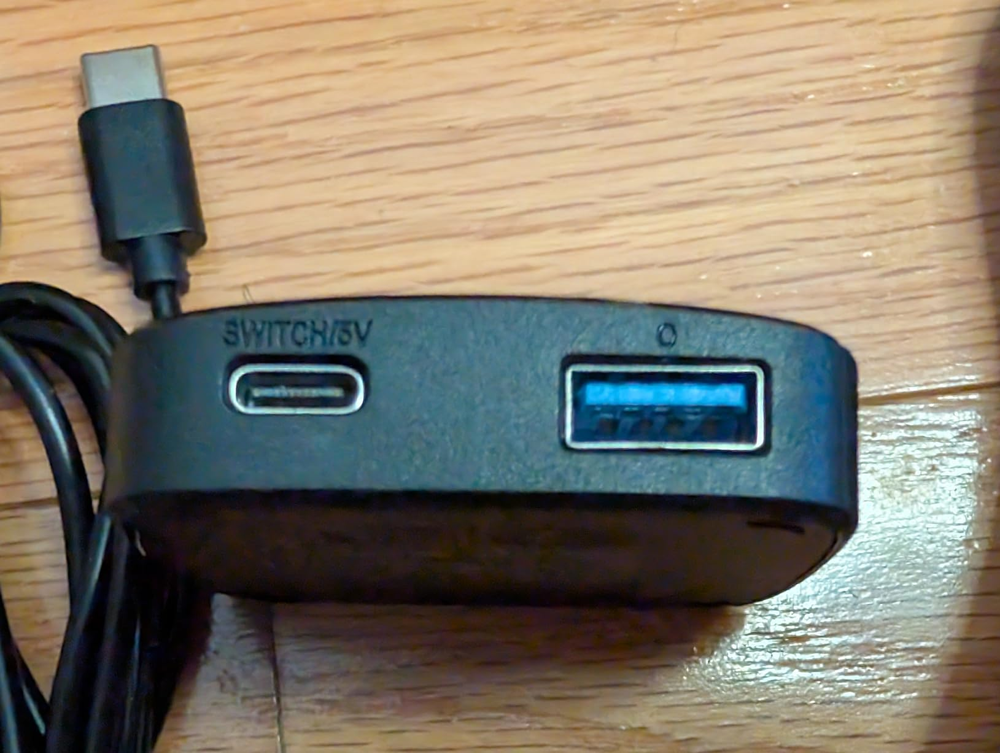
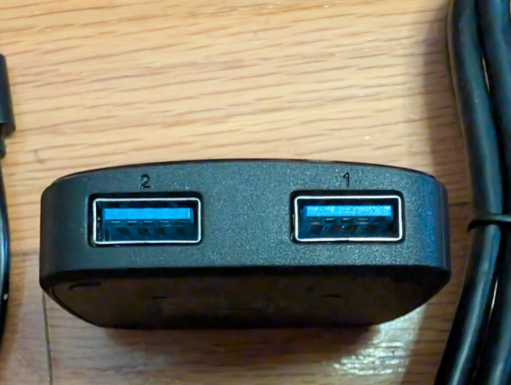
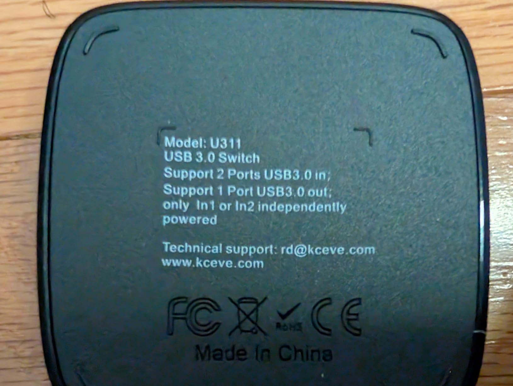

Quick summary:

+ Works for switching one USB-A device between two computers

+ Supports USB 3.0 5 Gbps speeds

+ Having both a button on the main "hub" and an external button is nice

+ They included a double-sided sticky pad for the external button

- Does not support video

- Only one USB device (unless you add a hub)

- Uses the wrong connectors, so then you have to use the included non-standard USB-A to USB-A "suicide cord"

- External power does not work correctly

- USB 3.0 10 Gbps devices do not work (connects then disconnects until it eventually gives up and switches to USB 2.0)

- No USB emulation, so the computers see switching as disconnecting from one and connecting to the other

- external button switches between green 1 and 2, while "hub" switches ring between red for 1 and green for 2

I kind of hate this thing. I ordered the "4K Switch 2 PC 1 Monitor" variant, and not only does it not support 4k or any number of monitors, it's not even a good design for what it does support because it uses the wrong USB connectors on the back so you have to use the included non-standard USB cables.

I tested it with a few different devices:

* A basic USB 2.0 wireless dongle for a keyboard/mouse combo - worked great

* My phone - file transfers were fairly zippy at USB 3.0 5Gbps

* An external SSD that supported 10 Gbps - the computer would see it but then immediately disconnect. After a while of this, it would sometimes give up and connect at USB 2.0 speeds. So, I'm guessing that it doesn't have the correct wiring or signal integrity or something for 10 Gbps.

Also, it claims to support external power via the USB-C port (that you would otherwise connect the external button to), but I could not get that to work:

* With a USB-C to USB-C power cable, as soon as I connect the power, the light switches color, the button stops working, and the device is disconnected from both computers.

* With a USB-A to USB-C power cable, the device remains connected to one computer, but pressing the button disconnects it from both.

If you can get past all that jank, though, it could actually be helpful for sharing a single USB device between two computers. It's half-baked and poorly advertised, but it's not completely useless.

