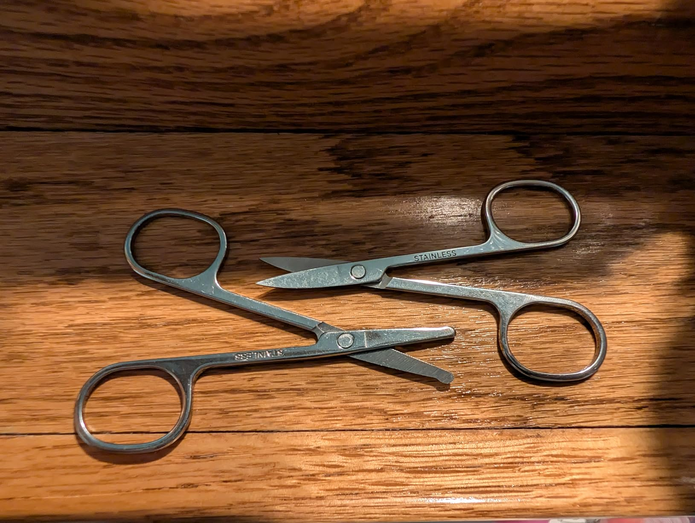
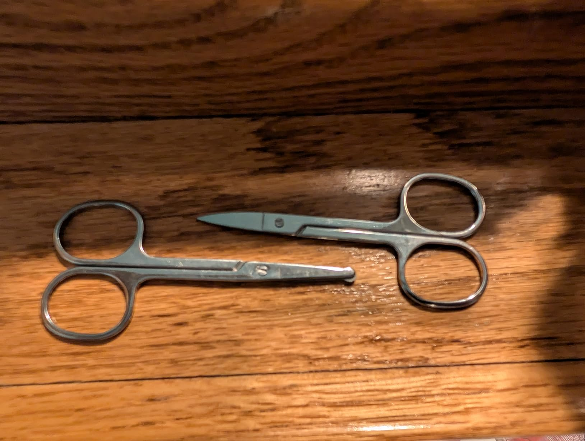
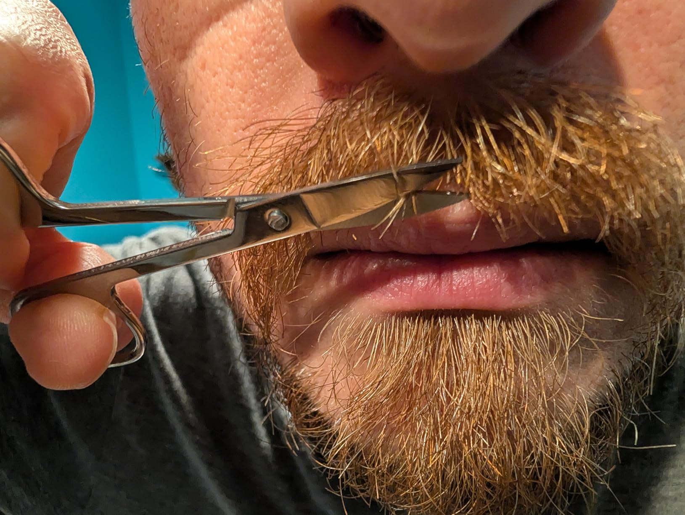

No spoken audio

These work great, they're sharp and cut cleanly. I don't think I'd ever seen a pair with a bulbous/rounded end before, but I can definitely see the value having tried it now.

I tested both one out, and was satisfied with the cuts that each gave me. For the rounded one in particular, I had less concern than normal about cutting my skin. I even tried poking it in a little bit and it did not cut me, which is not something I would have been even willing to try with a normal sharp pointed pair.

I also like that they're both stainless steel, so they're not going to rust just from being in a humid bathroom.

Overall, I'm very happy with these and I expect they will meet my needs for sometime to come. For $3, there's really not much more you could ask for.

