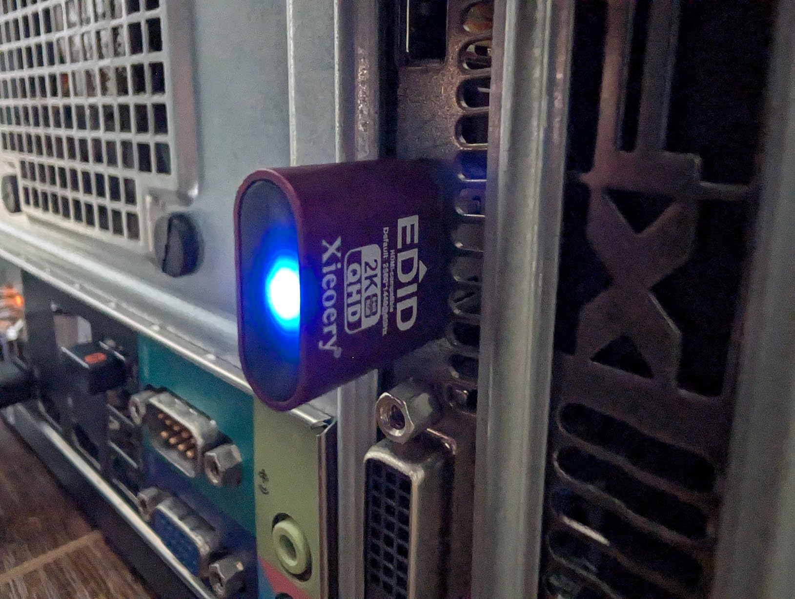
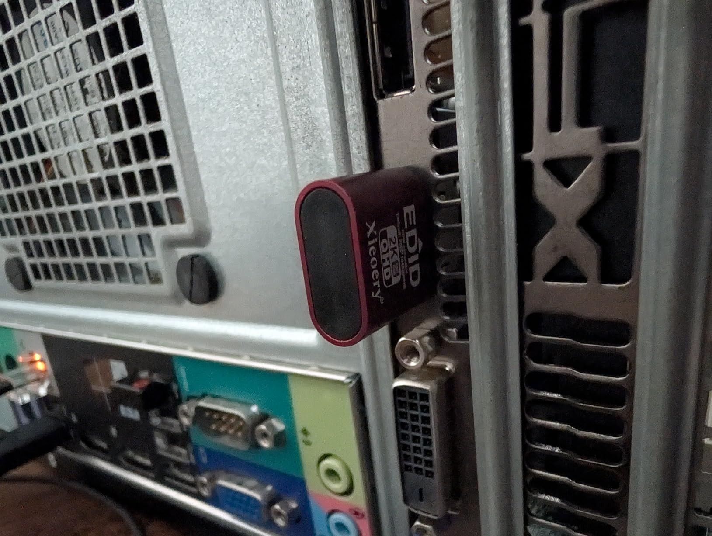

This mostly works, although I had a couple of hiccups, where it would stop working and the light would turn off when connecting or disconnecting a different (real) monitor to the same video card. Not sure if that's a quirk of my system or this adapter, but I figured it was worth calling out. In any case, unplugging it and plugging it back in brought it back to life.

Also in my case it defaulted to 1080i at 59.94hz despite being labeled "Default: 2560x1440@60hz". Not a big deal as it seems to support quite a wide range of resolutions and refresh rates. It can handle anything from 800x600 all the way up to 4096x2160. It supports refresh rates up to 120hz for 1080p and below, or 60hz all the way up to 4k (both the "real"4k" of 4096x2160 and the "marketing 4k" of 3840x2160.)

This adapter did wake back up when I let the computer go to sleep and then woke it up again, so that was good.

Overall, I'm pretty happy with it and I think it will serve its main purpose of letting me do game streaming without having to have a real monitor connected and powered on.

