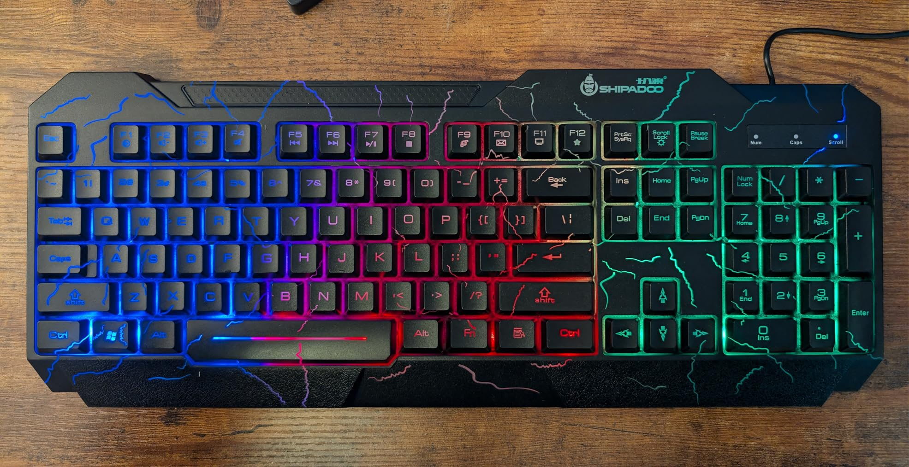

This keyboard seems relatively fine for $22, but it does leave a little bit to be desired.

In terms of n-key rollover, it supports a maximum of 6 keys pressed at once, with up to 4 regular keys (A, B, C, etc.) and up to 4 modifiers (Control, Alt, Shift, etc.) Additional keys will be ignored when depressed.

Physically the keys are fine. They're membrane, so you don't get the nice feeling of a mechanical keyboard, but it is fairly quiet and easy to press. Definitely nicer than many laptop keyboards I've used.

The lights are the biggest disappointment, though. They're fixed color, so there's only one pattern it can show, and things are brighter in some areas and darker in others. Furthermore, it's tied to the Scroll Lock - if scroll lock is on, then the backlight is on. If scroll lock is off, then the backlight is off. This means it's often unlit when you first plug it in or boot up your computer.

All that said I'm partial to the rainbow pattern (even if I would prefer it to be animated), and the diffusion is relatively nice: bright enough to see every key without being blinded.

The "cracked" design is kind of meh - I like that it lets a little bit more light through, and I could imagine it fitting well with a certain build, but it isn't my thing.

All in all, it's fine. I'm going to use it to type things and play games, and it works well enough for that.

