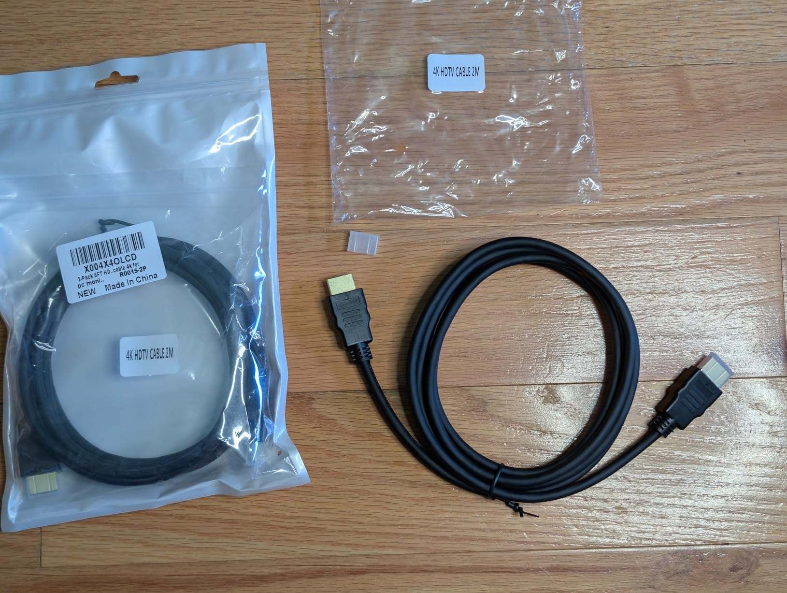
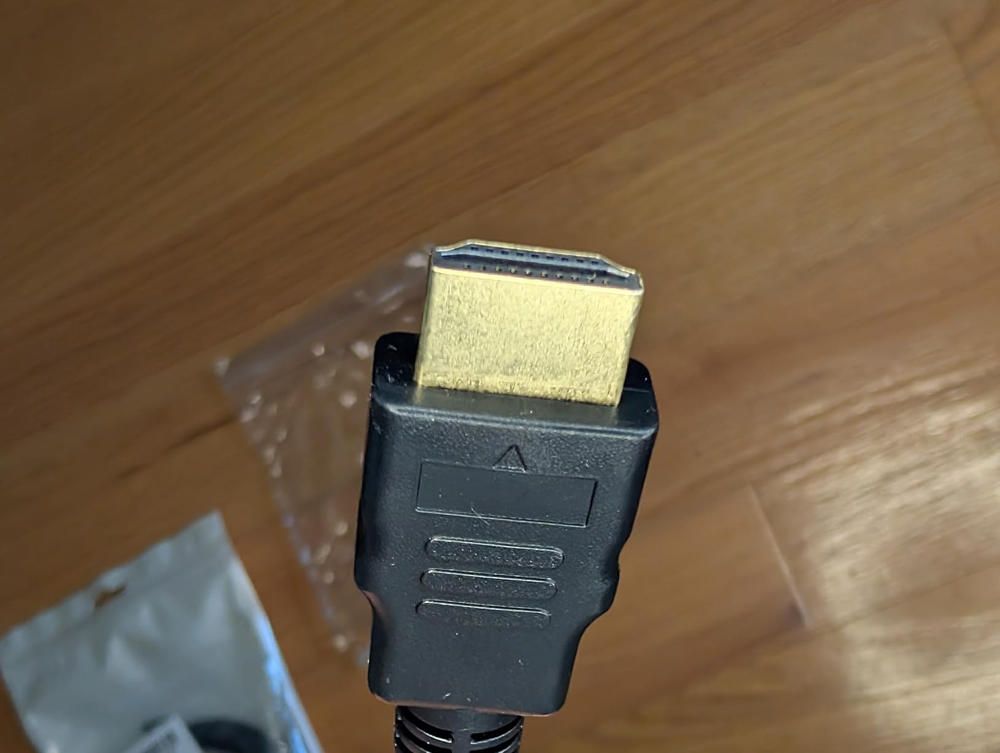
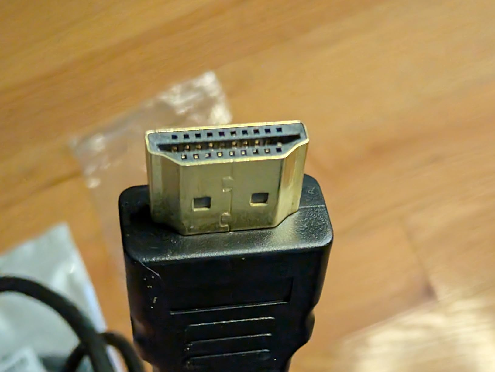

This cable is solid and reliable, and a great deal at 2 for $7.

The connectors are reasonably sized at about 20x10x30mm with an indentation on the sides to get an easier grip, then there's about 8mm of fairly stiff strain relief. The cable itself is about 5.4mm thick and fairly flexible with a bend radius of maybe 20mm feeling safe. It's a bit over the advertised 6 foot length, I think it might be 2 meters (~6'6") if you include the connectors.

Everything is made from a black rubbery material that feels sufficiently sturdy and easy to get a grip on.

