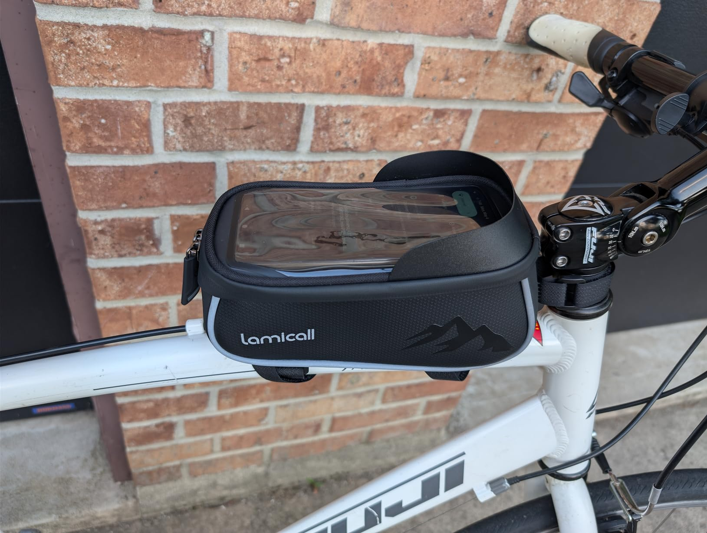
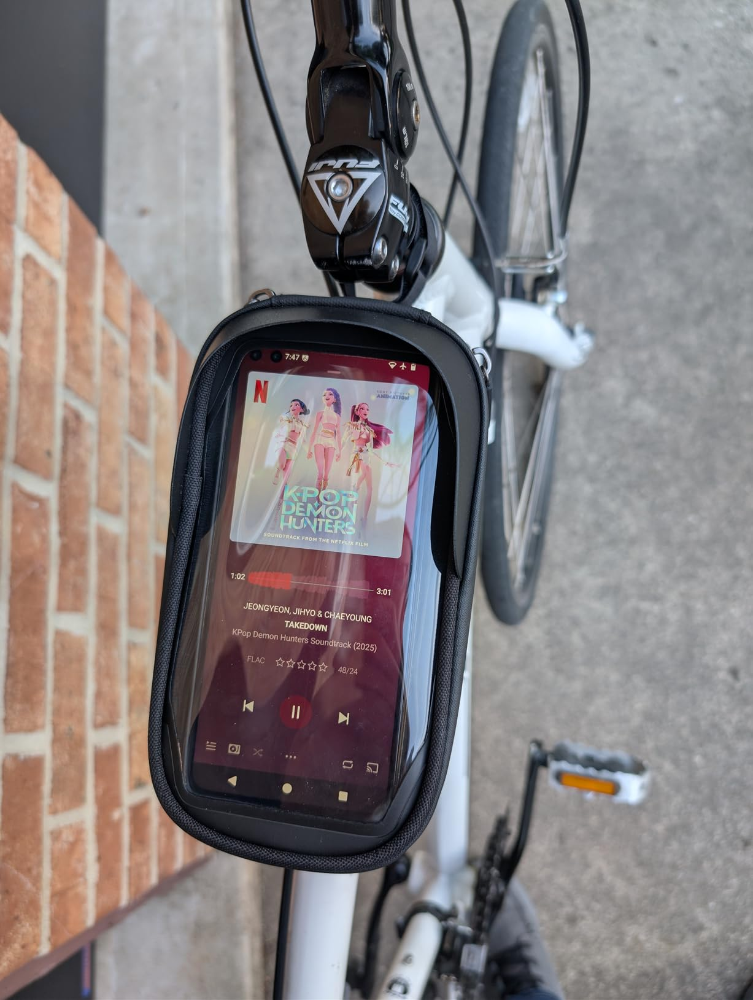
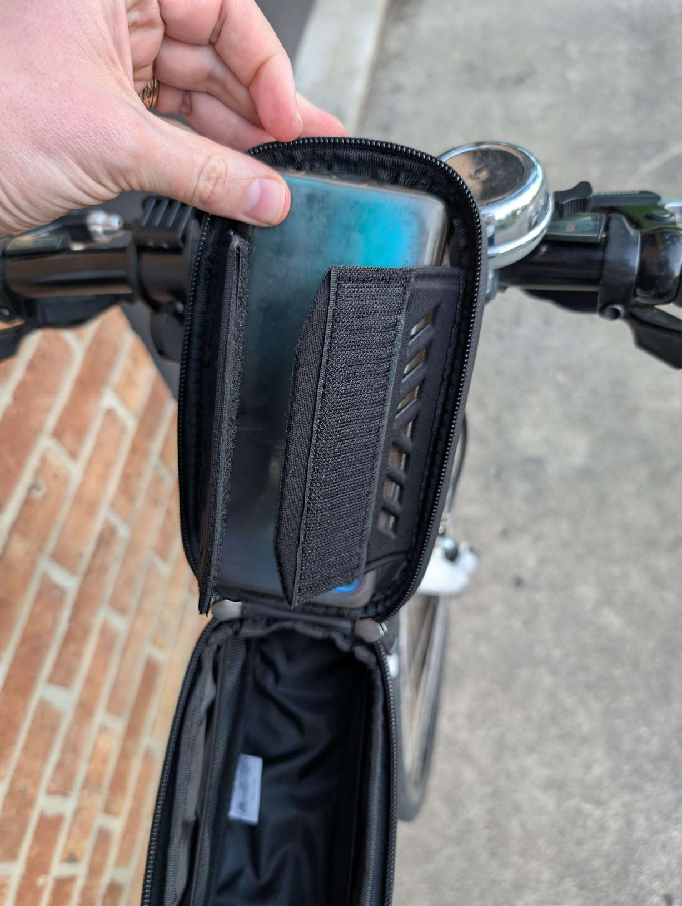
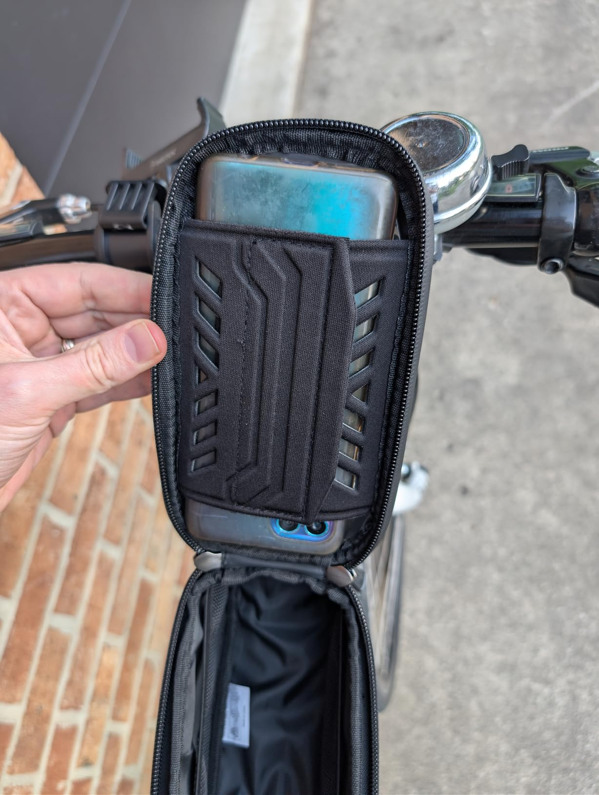
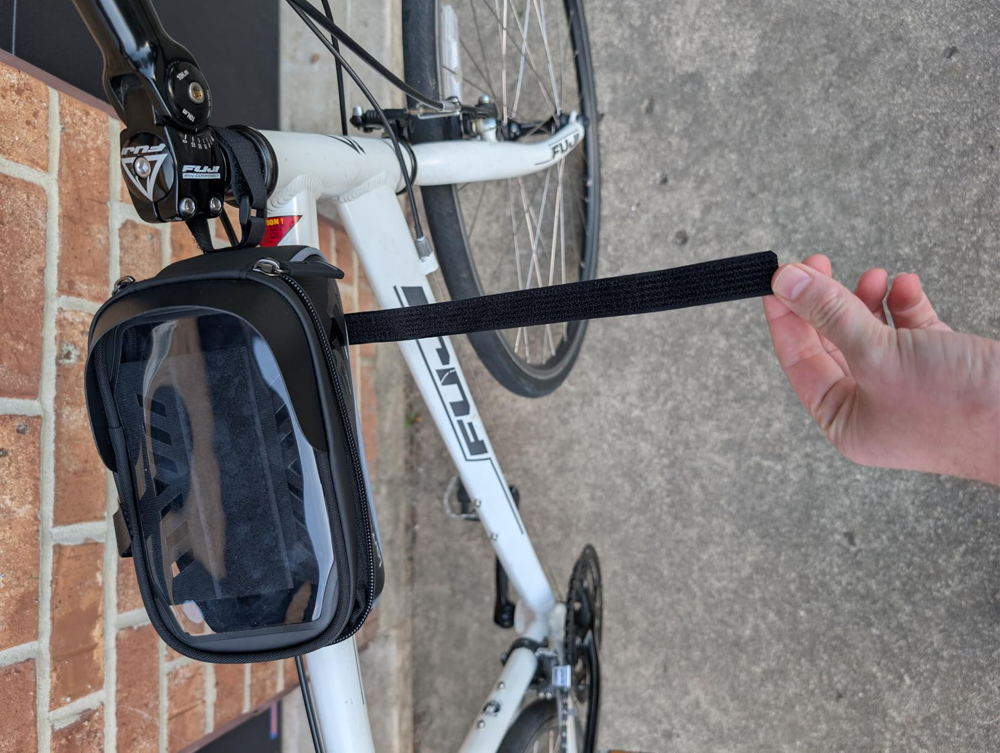

This was very easy to install and fits my bike great. I was a little concerned about the front strap going around a part of my bike that turns with the handlebars (the "stem", I think), but it doesn't seem to be an issue. The pouch stays put while the handlebars turn.

The straps for underneath are extra long; they could probably even fit around an e-bike with a battery in that section. For a regular size bike like mine, the instructions say to cut off the excess Velcro, but I just wrapped it around a couple of times so that I could move it to a different bike if I wanted.

Your phone goes in the top, held in place by a couple of stiff flaps that Velcro to each other. It's big enough to fit fairly large phones like my Moto G100 (2021) with its 6.7" screen. The plastic doesn't seem to interfere with the touchscreen at all, and with tap-to-wake, I can turn it on easily enough.

That said, the side buttons are not accessible when the phone is in the pouch, so no volume control, no power button, and you can't use a fingerprint reader on the power button if you can't access the power button.

I also tested a different phone with an in-screen fingerprint reader (Pixel 9 Pro), and that one does not seem to work through the plastic either. It knows the sensor is being touched, but it doesn't recognize the finger.

All that said, it's fine for running maps or controlling your music.

I didn't try the headphones port, but I could hear music from the phone's speaker decently well through the bag.

You have to unzip the zippers all the way to be able to open it, because it's hinged on the short side. That is a little annoying at times, but not a big issue.

It's apparently not waterproof, so it comes with a little green shower-cap that you're supposed to put on top of it if there's a chance of rain. Seems kind of silly to me.

There's plenty of space inside for your keys, wallet, and maybe a power bank or sunglasses or a couple of smaller tools.

Overall, I'm pretty happy with it. The current price of $20 (with coupon) seems fair for what it is.

