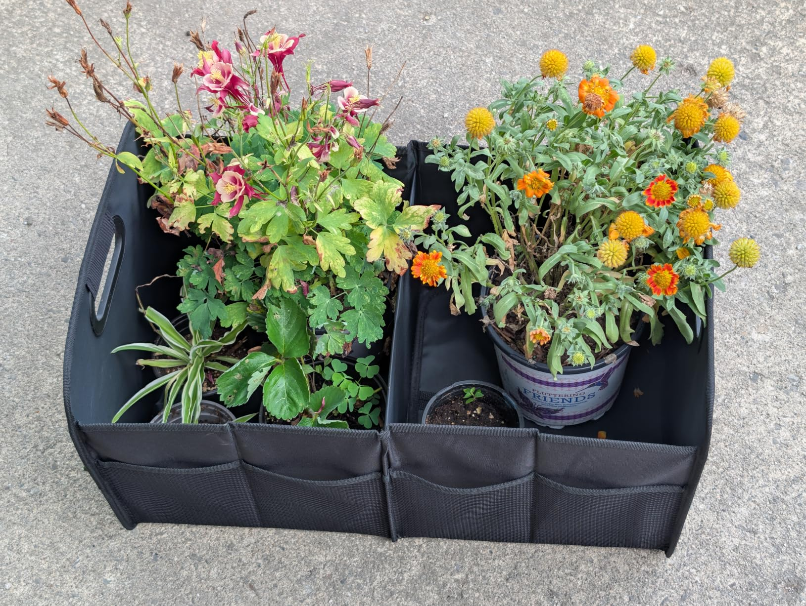
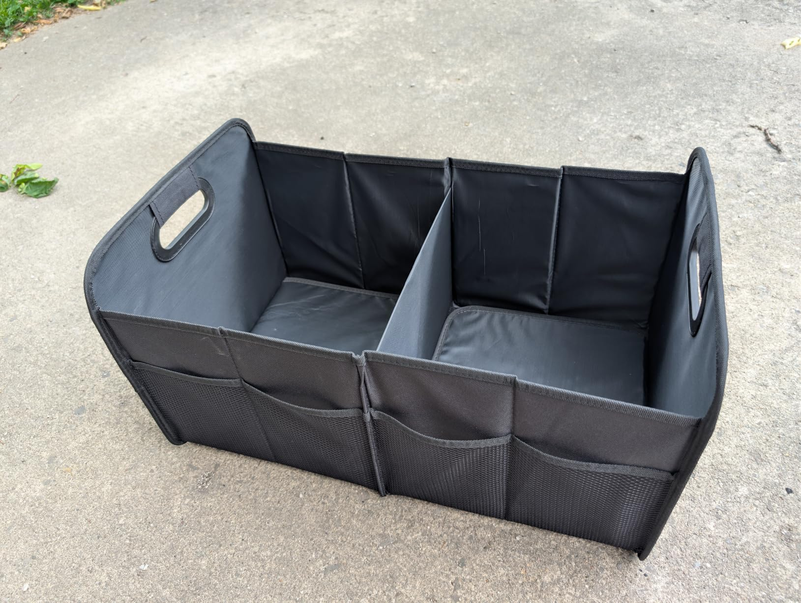
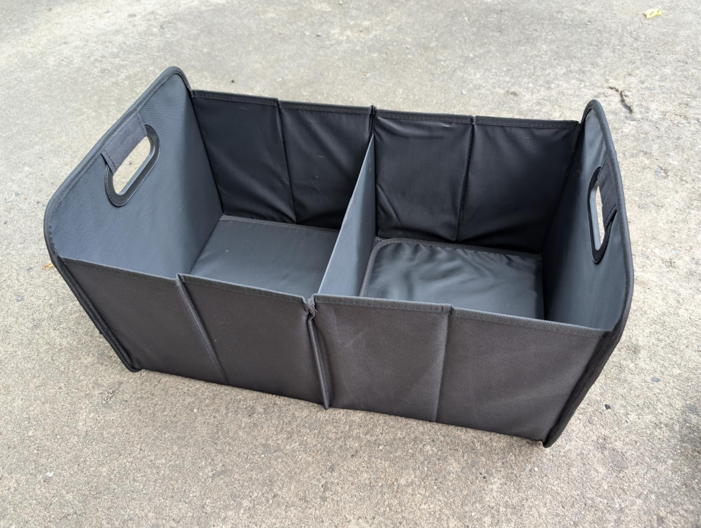
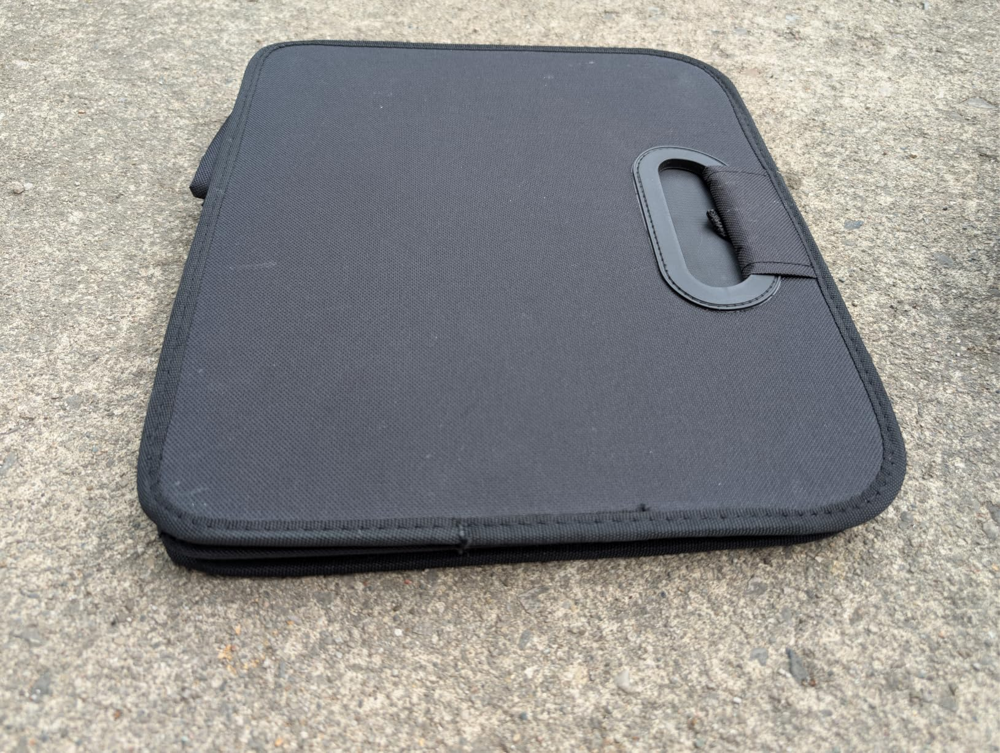
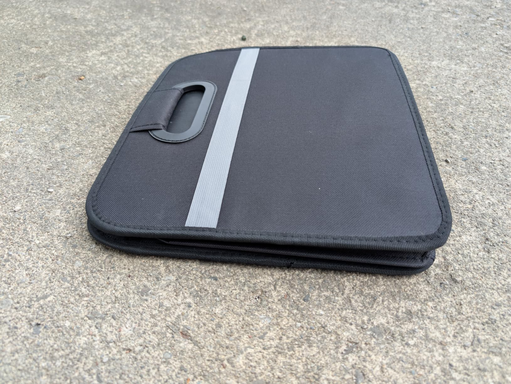

I'm pretty happy with this organizer overall. It's been fairly convenient on the occasions when I have needed it, and it's very easy to flatten down and move out of the way when not needed.

I was able to load a bunch of plants from a plant sale into it and then easily get them out of my trunk and into my garage. It kept everything upright, contained all the mess, and was itself fairly easy to clean out.

It hasn't yet become a permanent fixture in my trunk, but it might. My main concern is I'm worried if I set heavier things on top of it might just get crushed.

I think all the little pockets on the one side might get more use if it did become a permanent fixture though. I'm really not sure when the silver velcro stripe on the other side would be useful, but I do kind of like it. I wish it had the same stripe and pockets on the opposite two sides.

The asking price of $20 seems OK, although certainly not the lowest on the market.

Overall, I'm pretty happy with it and I think it serves its purpose well.

