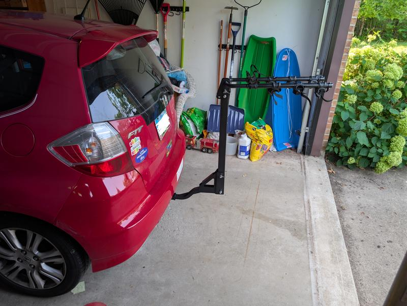
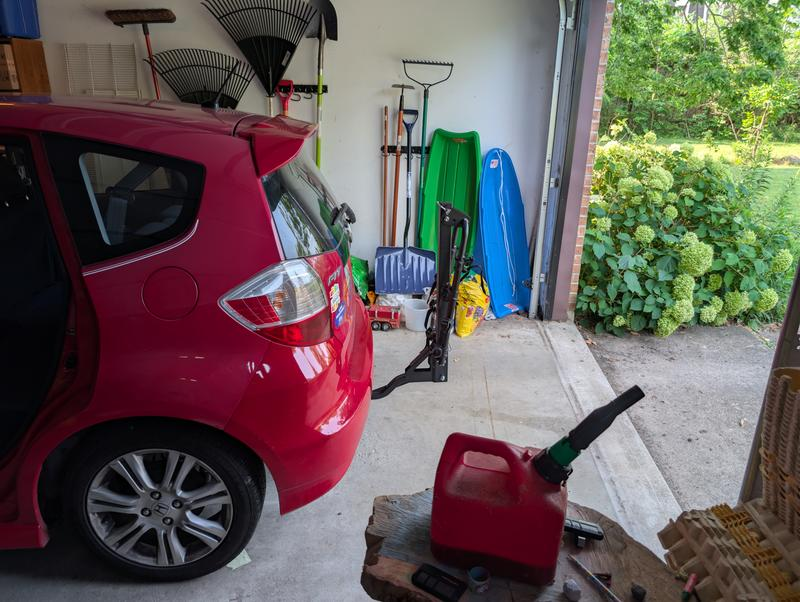
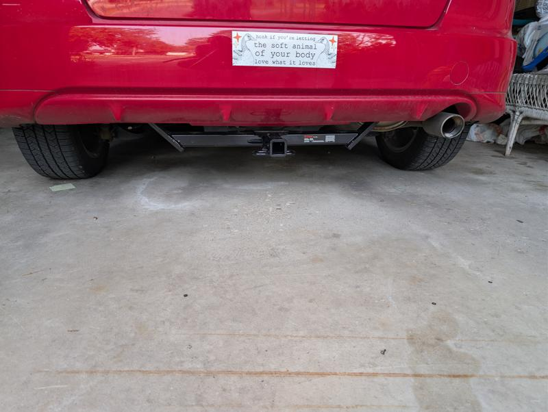
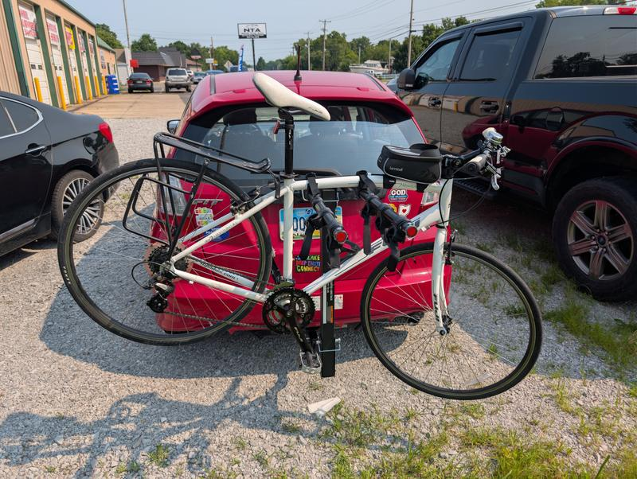

Now that I've got it working, I really like the bike rack, but out of the box it was completely unusable. 

When they welded it together, they were sloppy and a little blob of material got left inside one of the holes that the pin is supposed to slide through to lock wreck and it's upright bike carrying position. When I tried to use it, the pin would not fit in the hole at all. 

Fortunately I was at my mechanic shop (they had just installed the trailer hitch receiver) and they were able to file off the extra material and make the thing usable. Tells me that nobody at the factory actually tested before sending it out. 

Also, mine had some scratches on it which made me think that somebody else had bought it and returned it, probably due to the same issue. If so, that was another missed opportunity to resolve the issue. 

Now that it's repaired, I actually really like it. My bike went on easily and stayed firmly in place, and this is one of only a few designs that can actually hold four bikes on a 1.25 in receiver. 

One thing to be aware of: once you remove the locking pin that lets it swing down so that you can get into your trunk, the whole thing just falls on you. There's no maximum angle, it just swings down until you catch it or it hits the ground. I probably should have expected this, but it surprised me a little bit the first time I did it. 

Overall, I'm not going to ding it too hard because it does feel like a pretty good value. But I wish they had done a tiny bit of Quality Assurance before shipping it out. 

Oh, also, I found the product on the manufacturer's website because I wanted to know if there was a per-bike weight limit, in addition to the overall 120 lb limit. The specs on the page really confused me until I realized they were for a completely different 2-bike rack, that I assume somebody just copy-pasted and forgot to update.

