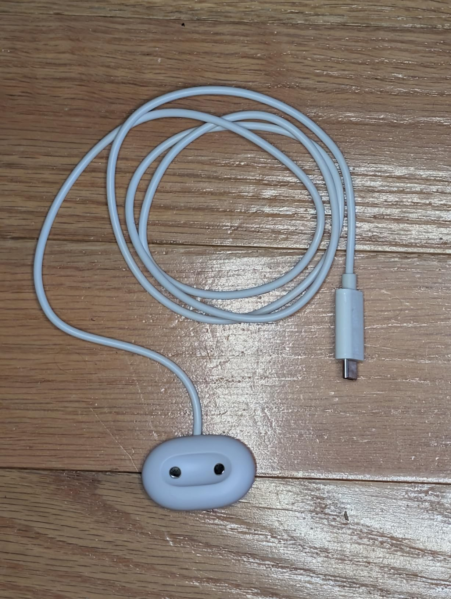
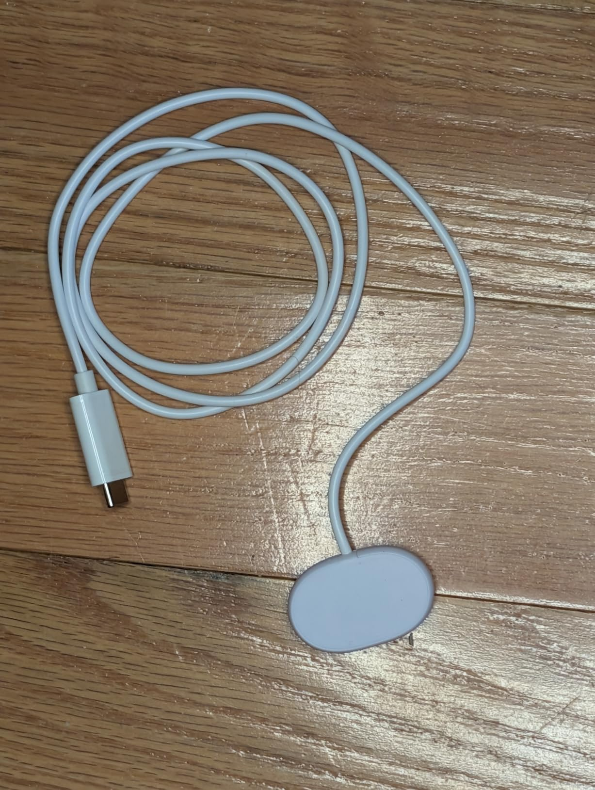
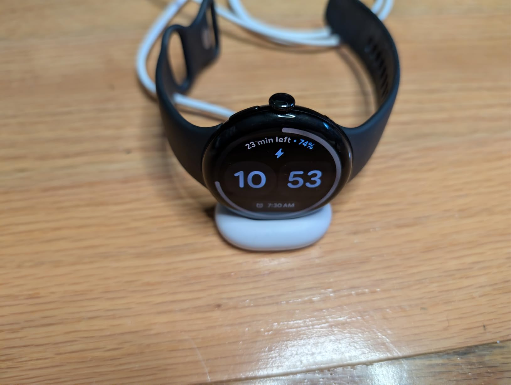

At first glance, this looks nearly identical to the official charger, and to be fair, it does charge the watch.

However, the original design makes it too easy for the watch to come loose and not actually charge, and this clone just amplifies the flaws without adding anything of value aside from a cheaper price.

Compared to the original, this charger is lighter (24g vs 36g), doesn't have the grippy rubber bottom, has a stiffer cable, and has a weaker magnet (it takes around 1/2 to 2/3 of the force to separate the watch from this charger compared to the original). All of these combine to make it even more likely that something will shift and your watch will fail to actually charge. Ask me how I know.

Additionally, when it does charge, it goes at less than half the speed of the official charger (~2.3w vs ~5w)!

Finally, the plug housing is slightly chunkier than the original, maybe 1-2mm larger in width and depth. I don't think it's likely to be an issue, as they're both relatively small, but it is one more example of this being a slightly inferior copy.

Overall it's fine. It does the job at under half the cost of the original, so I can't knock it too hard, but this is a good example of "you get what you pay for".

